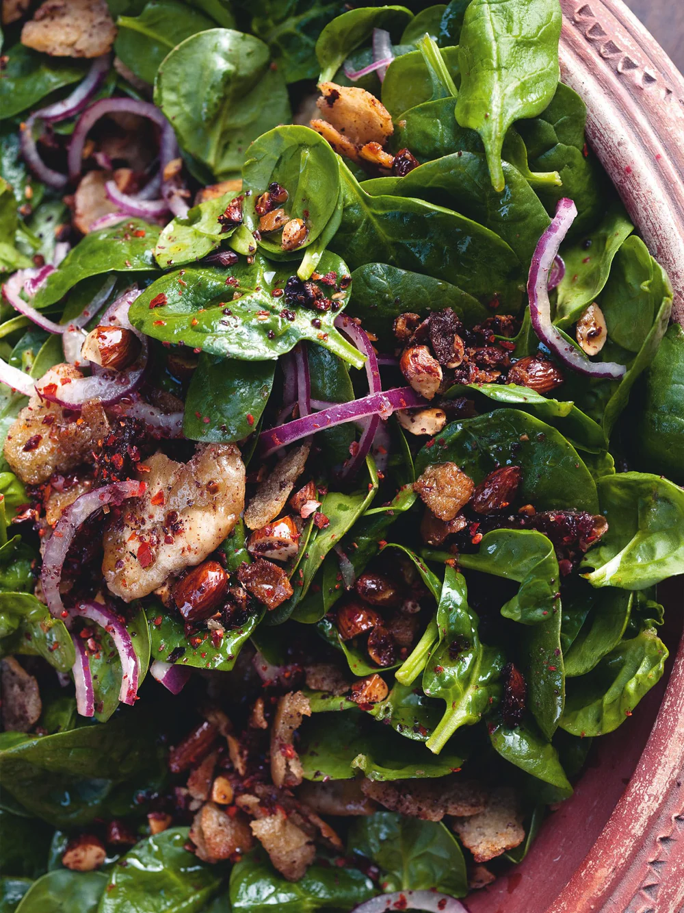

---
image: ../pics/salad-dates-almonds.webp
---
# Салат с финиками и миндалем

#### Ингредиенты

* белый винный уксус 1 ст л
* финики без косточек 100 г
* сливочное масло несоленое 30 г
* оливковое масло 2 ст л
* засохший хлеб или лепешки 100 г
* цельный миндаль 75 г
* хлопья чили 0,5 ч л
* сумах 2 ч л
* молодой шпинат 150 г
* лимонный сок 2 ст л

#### Приготовление

Нарезать финики на четвертинки, положить уксус и финики в небольшую миску, добавить щепотку соли и хорошо перемешать руками. Оставить мариноваться на 20 минут, затем слить остатки уксуса и выбросить.

Тем временем разогреть сливочное масло и половину оливкового масла в средней сковороде. Хлеб или лепешку нарезать и грубо порвать на кусочки по 4 см. Добавить хлеб и миндаль в сковороду и готовить их на среднем огне 4–6 минут, постоянно помешивая, пока хлеб не станет хрустящим и золотисто-коричневым. Снять с огня и смешать с сумахом, чили и ¼ чайной ложки соли. Остудить.

Для подачи смешать листья шпината с хлебом в большой миске. Добавить финики, оставшееся оливковое масло, лимонный сок и еще щепотку соли.

*Yotam Ottolenghi, "Jerusalem"*
