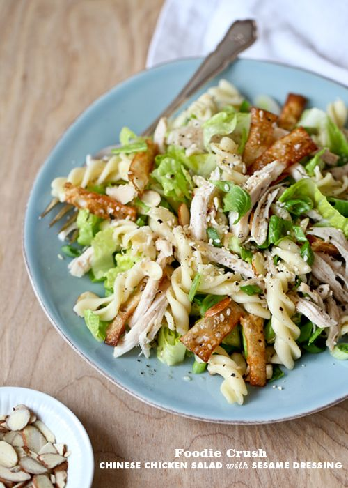

---
image: ../pics/a439e32ff0b024338725afcbea7868a2.jpg
---
# Салат с пастой и курицей в азиатском стиле

#### Ингредиенты
на 2 порции

* 1/4 чашки кукурузного масла для жарки
* 4 чашки салата латук
* 1 куриная грудка
* 1/4 чашки миндальных лепестков
* 1 ст ложка кунжута
* 2 чашки охлажденной отварной пасты
* _12 3 дюймовых кусочков теста wonton_

**для заправки:**

* 1,5 ст ложки растительного масла
* 6 ст ложек рисового уксуса
* 1 ч ложка кунжутного масла  _\(заменяла парой капель арахисового\)_
* 1 ч ложка сахара _\(лучше меньше\)_
* 2 ч ложки соевого соуса
* 2 ст ложки кунжута
* 0,5 ч ложки свежемолотого перца
* 0,5 ч ложки соли

#### Приготовление

Разогреть масло на сковороде, обжарить wonton по 30 сек с каждой стороны, до золотистого цвета. Откинуть на бумажные полотенца.  
Приготовить куриную грудку \(отварить или пожарить\).  
В миске смешать салат, курицу, пасту и миндаль. Смешать в соуснике все ингредиенты соуса, мешать до полного растворения сахара. Украсить салат семечками кунжута, заправкой и приготовленными кусочками wonton.

*foodiecrush.com*
