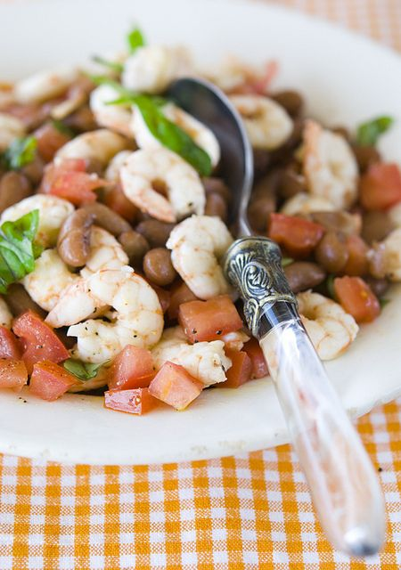

# Салат с фасолью и креветками

#### Ингредиенты:

2 порции

* креветки 200 г
* фасоль красная консервированная 100 г
* зубчик чеснока
* листья свежего базилика
* 1 большой помидор
* оливковое масло, винный уксус
* соль, перец, шалфей сухой

#### Приготовление:

Фасоль откинуть на дуршлаг, чтобы стекла лишняя вода, а затем переложить ее в салатник. Добавить очищенные креветки и порезанный кубиками помидор. Посолить, поперчить и добавить листья базилика и шалфей. Заправить салат оливковым маслом и уксусом.

*Элла мартино*