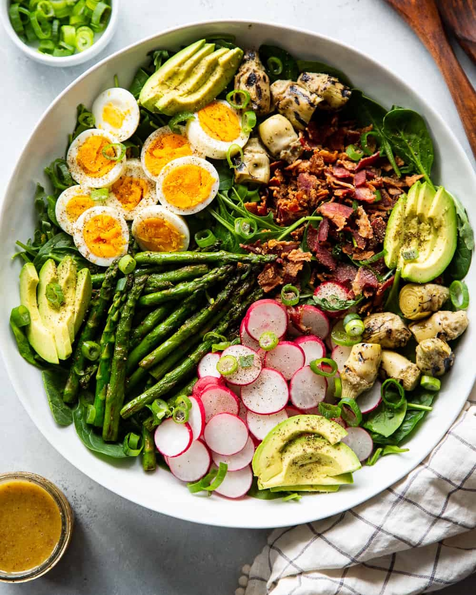

# Весенний кобб салат

#### Ингредиенты

на 2 порции

* горсть салатных листьев
* черемша
* 1 отварная или запеченная куриная грудка
* 2 крутых яйца
* спаржа
* 1 авокадо
* маринованные артишоки
* редис
* бекон 4 полоски
  
**для соуса:**
* мёд 1 ст л
* горчица с зернами 1 ч л
* дижонская горчица 1 ч л
* белый винный уксус 2 ст л
* оливковое масло 4 ст л

#### Приготовление

Чеснок пропустить через пресс.

Смешать измельченный чеснок с двумя видами горчицы, уксусом и маслом.

Бекон обжарить на раскаленной сковороде пока он не станет немного хрустящим.

Все ингредиенты для салата \(кроме салатных листьев\) нарезать небольшими кубиками или короткими полосками.

В тарелку выкложить салатные листья.

Сверху полосками выкложить остальные ингредиенты.

Заправка подается отдельно.
