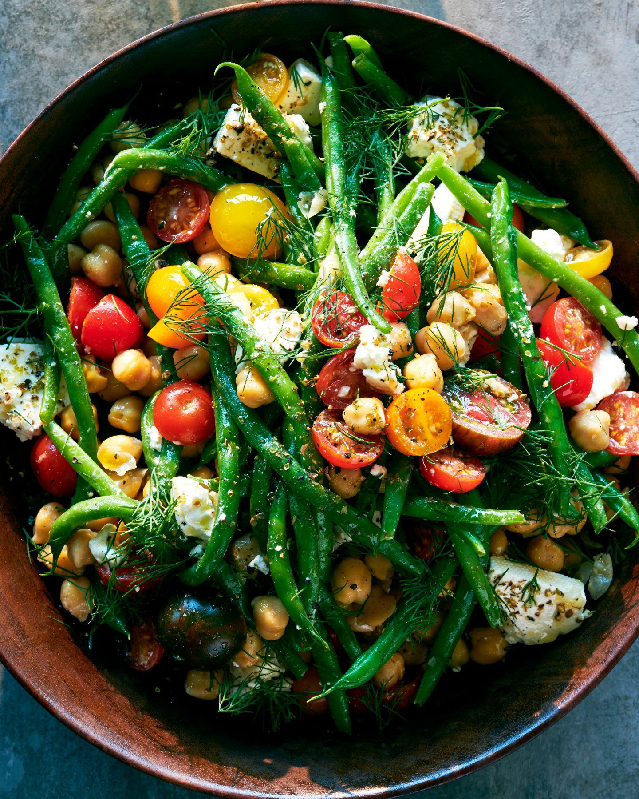

---
image: ../pics/tomato-green-bean-salad.jpg
---
# Салат с томатами, стручковой фасолью и нутом

###### Ингредиенты

* стручковая фасоль
* лимонный сок
* красный винный уксус
* чеснок
* оливковое масло
* помидоры черри
* консервированный нут
* фета
* укроп
* сушеное орегано
* соль, черный перец

#### Приготовление

Бланшировать фасольв кипящей воде с 1 ложкой соли. Остудить и высушить.

Приготовите заправку: смешать лимонный сок, уксус, оливковое масло в пропорции 2:1:3, добавить чеснок и черный перец, орегано.

Смешать помидоры черри, стручковую фасоль и нут в салатнице, добавить заправку и перемешать. Добавить фету и перемешать еще раз. Оставить мариноваться на 10–15 минут.

Подавать, посыпав нарезанным укропом.

*NY Times*
