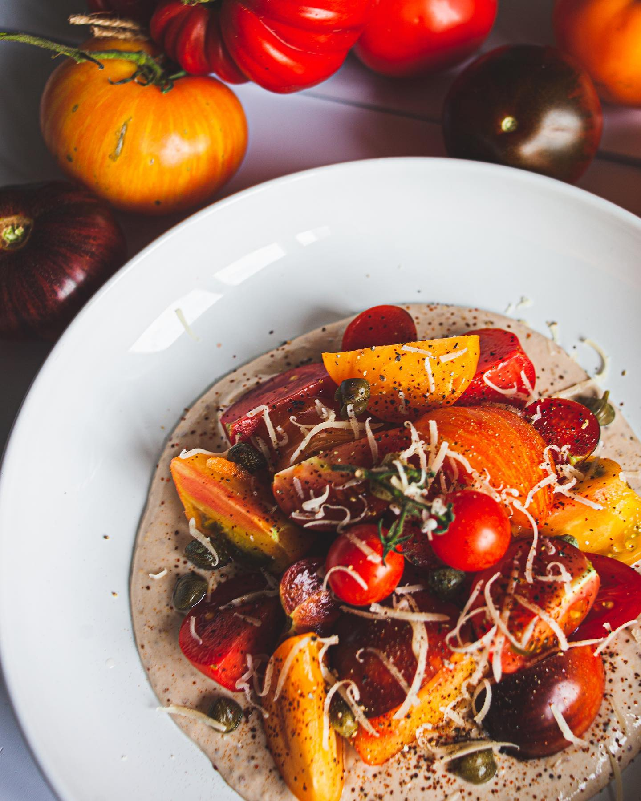

---
image: ../pics/tomato-tuna.jpg
---
# Помидоры с тунцовым соусом

#### Ингредиенты

* разноцветные помидоры
* каперсы
* пармезан

**для соуса:**
* 1 банка тунца
* 2-3 филе анчоуса
* 100 г греческий йогурт
* зернистая горчица 1 ст л
* сливки 20% 50 г
* оливковое масло 50г
* соль и перец по вкусу

#### Приготовление

Все ингредиенты для соуса положить в блендер и взбить до однородности и пышности.
Помидоры нарезать крупно. На тарелку щедро выложить соус. Выложить на него помидоры. Сверху немного каперсов и сыра, приправить солью и перцем.

Подавать со свежим хлебом.

*ig: dont.miss.the.breakfast*