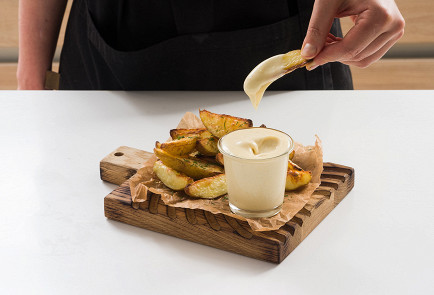

---
image: ../pics/cheese.jpg
---
# Сырный соус

#### Ингредиенты

* Сыр чеддер 150 г
* Сыр гауда 150 г
* Сливочное масло 70 г
* Пшеничная мука 70 г
* Молоко 600 мл
* Мускатный орех по вкусу
* Горчичный порошок по вкусу
* Соль по вкусу
* Молотый черный перец по вкусу

#### Приготовление

Натереть сыры на средней терке. В сотейнике с толстым дном растопить сливочное масло. Всыпать муку и перемешивать соус в течение 5 минут на среднем огне. Постепенно влить молоко, продолжая перемешивать соус. Перемешивать соус на среднем огне, пока он не загустеет. Следить за тем, чтобы соус был однородным и в нем не было сгустков и комочков Добавить соль и перец по вкусу. Добавить мускатный орех и совсем немного горчичного порошка, буквально щепотку. Снять сотейник с огня, добавить четверть от всего натертого сыра. Перемешивать соус, пока сыр не расплавится. Затем частями также добавить остальной сыр. Перемешивать соус, пока весь сыр не растворится. Готовый соус должен быть гладким, вязким, однородным и глянцевым.

Хранить в холодильнике до 5 дней

*eda.ru*
