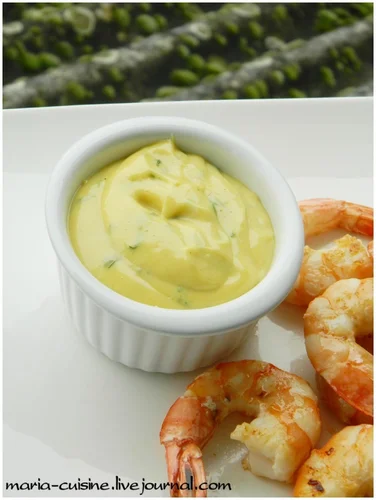

# Креольский майонез

#### Ингредиенты

* 1 яичный желток
* 1 ст.л. острой горчицы
* чесночное оливковое масло \(оливковое масло, настоянное на чесноке\)
* кинза
* чили \(пудра\)
* сок 1 лайма
* сок 1/2 апельсина
* соль, перец

#### Приготовление

Горчица+желток, размешать. Добавлять масло. Готовить как майонез! Добавить мелко нарезанную кинзу, специи и цитрусовые соки.

_maria-cuisine.livejournal.com_
