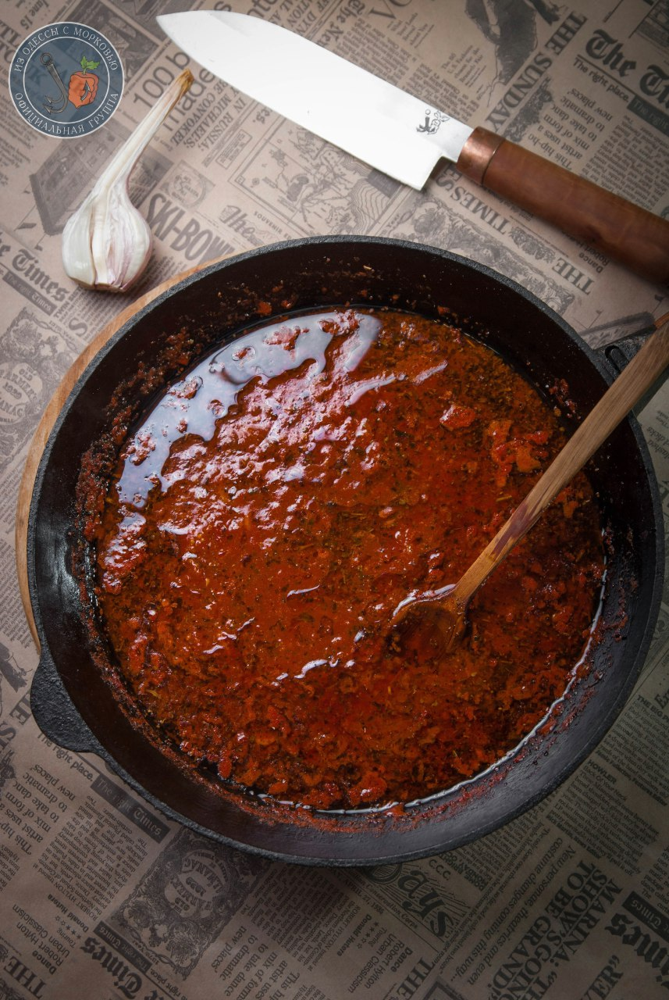

---
image: ../pics/photo_2019-04-22_16-00-26.jpg
---
# Маринара \| Alla marinara

#### Ингредиенты

* 2 зубка чеснока
* 50 мл оливкового масла
* 800 гр помидоров в собственном соку
* 1/2 ч.л. гранулированного чеснока
* 1/4 ч.л. сухой горчицы
* 1/4 молотого черного перца
* 2 столовых ложки сухого базилика
* 200 мл куриного бульона или сок, что был в помидорах

#### Приготовление

Тонко нарезать чеснок.  
Разогреть в сковороде все масло, добавить чеснок и готовить минуту, не допуская поджаривания. Добавить размятые вилкой помидоры, перемешать и готовить 5 минут. Добавить все остальные ингредиенты, перемешать и готовить еще 25-30 минут на маленьком огне. Соус не должен быть жидким. В этом случае готовьте еще.  
Попробовать. Если ваши помидоры дали излишнюю кислоту, добавить сахар.

*Dogs. The mafia Cookbook*  
*Tg:OdessaCarrot*
