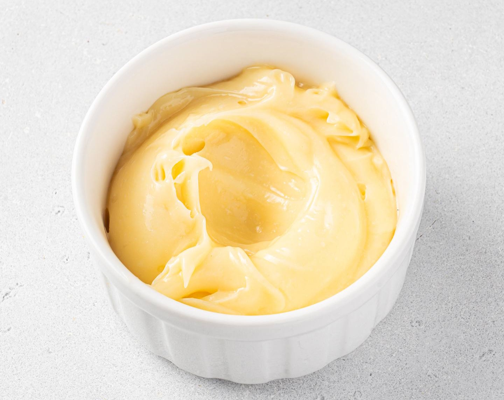

---
image: ../pics/mayonnaise.jpg
---
# Майонез \| La mayonnaise

#### Ингредиенты
на 1 желток

* растительное масло 150-200 мл
* чайная ложка горчицы
* цветной уксус алкоголя \(или лимонный сок\) чайная ложка
* мелкая соль
* белый или кайенский перец

количество уксуса и горчицы примерное, лучше пропорции подбирать под свой вкус и свои продукты

Все ингредиенты должны быть одной комнатной температуры.

В миске с нешироким дном объединить соль, перец и уксус, дать соли раствориться. Добавить желтки и горчицу. Перемешать.

Начать постепенно добавлять масло, не по капле, а просто понемногу, хорошо взбивая. Затем увеличивать количество масла добавляемого за раз, постоянно и энергично перемешивая венчиком. Чем дольше вы взбиваете майонез, тем лучше и плотнее у него в итоге получится консистенция.

Выправить на соль и перец. Накрыть плёнкой и хранить в холодильнике. Я майонез не храню больше 24 часов.

_lg: maria-cuisine_

