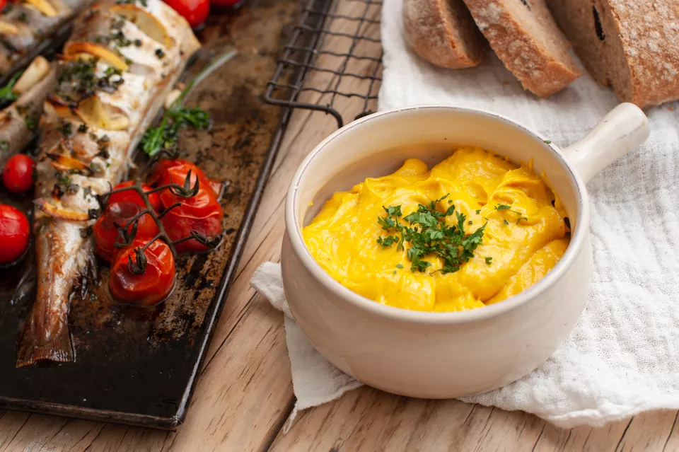

---
image: ../pics/rouille.webp
---
# Cоус руй \| Rouille

Rouille в переводе с французского означает ржавчина, ржавый цвет. Наверно, поэтому этот соус и носит такое название, из-за цвета.

Руй - это соус провансальской кухни \(провансальский майонез\), достаточно острый и пикантный, подаётся обычно к рыбному супу \(soupe de poisson\) и к знаменитому буйабесу \(bouillabaisse\).

#### Ингредиенты

* яичные желтки - 2 шт
* чеснок - 10 г
* оливковое масло - 250 мл
* шафран \(пудрой\) - 1 г
* лимон - 1/2
* соль и кайенский перец

#### Приготовление 

В миску влить яичные желтки и сок 1/2 лимона. Посолить, поперчить, добавить измельчённый чеснок. Взбить соус с оливковым маслом \(венчиком, сначала влив несколько капель масла, затем постепенно добавив остальное масло\). Добавить шафран, хорошо перемешать и держать соус в холодильнике.
