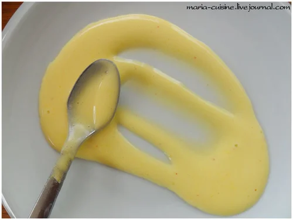

# Голландский соус \| Sauce hollandaise

Классический соус. Его чаще всего подают к рыбе и отварным овощам.

Голландский соус и его производные прекрасно подходят к блюдам из рыбы, из яиц, к овощам отварным и приготовленным на пару.

Для приготовления голландского соуса важно использовать подходящую кастрюлю: в кастрюле большего размера, чем необходимо, яйца коагулируют слишком быстро и не увеличиваются в объёме.

Соус лучше всего готовить в небольших количествах и не оставлять на "завтра". Этот соус нельзя разогревать! А при остывании он оседает, становится каменным. Соус до подачи хранить под крышкой в тёплом месте \(40-50 С\), но температура выше 63 диссоциирует ингредиенты \(приводит к распаду\). В соусе не оставлять металлические ложки \(риск окисления\).

#### Ингредиенты

на 2 желтка

* 2 яичных желтка
* 13 мл воды \(т.е. 13 гр\)
* 125 гр сливочного масла
* лимонный сок \(примерно 1 ч.л.\). вместо лимонного сока для приготовления голландского соуса можно использовать белое вино или беловинный уксус
* соль, перец.

Время приготовления: 15-20 мин

#### Приготовление

Масло порезать мелкими кубиками и медленно растопить на водяной бане без помешивания. Снять образовавшуюся пенку. Хотя этот этап и не обязательный такие соусы на сабайоне, как голландский, беарнез, прекрасно взбиваются и на неочищенном масле.

Яичные желтки поместить в кастрюлю подходящего размера. Начать взбивать желтки венчиком, постепенно вливая холодную воду.

Венчиком хорошо взбить желтки, они должны вспениться.

Далее готовим сабайон \(sabayon\). Поставить кастрюлю с желтками на очень \(!!!\) слабый огонь. Венчиком энергично перемешивать смесь, делая восьмёрку. Смесь начнёт белеть.

Смесь должна увеличиться в объёме и стать очень пенистой. Снять смесь с огня, как только её температура достигнет 60С. \(Фото у меня сильно желтит, смесь получится почти белой\). Не обязательно расчехлять термометр, проверить, готов ли сабайон, можно двумя способами. По вкусу, у сабайона не должно быть вкуса сырого яйца. Очень субъективно, правда? Обычно готовность сабайона проверяют по следу, который оставляет венчик на дне кастрюли. Он должен быть устойчивым. Реально устойчивым! \(я взбила сабайон, включила фотик, сделала фото, а след ещё остался\).

Это самый важный момент приготовления таких соусов. Потому что если вы не доготовите сабайон, то соус получится невкусным, он не будет воздушным, нужной консистенции и на дне соуса отслоится жидкость.

Добавить к желткам соль и лимонный сок \(лимонный сок можно добавить и на заключительном этапе, в конце приготовления, что более правильно\).

К желткам постепенно добавить растопленное сливочное масло, постоянно перемешивая венчиком \(как при приготовлении майонеза\).

Если консистенция получается слишком густой, добавить немного тёплой воды.

Добавить в соус перец, довести до вкуса.

Можно процедить через сито, но при этом соус немного опадёт.

Тест на готовность соуса, устойчивый след:

Возможные ошибки и способы их исправления:

1. Чрезмерное сгущение сабайона. Причина: слишком сильный огонь или слишком большая кастрюля. Решение: подлить немного холодной воды.
2. Соус слишком густой/плотный. Причина: сабайон был передержан на огне или в нём было слишком мало воды. Решение: подлить немного тёплой воды.
3. Соус свёртывается в процессе добавления масла или после \(во время хранения\). Причина 1: масло было слишком высокой температуры или готовый соус хранился при слишком высокой температуре. Решение: снова взбить соус с добавлением небольшого количества холодной воды или кусочка льда. Причина 2: масло было слишком низкой температуры или соус хранился при слишком низкой температуре. Решение: снова взбить соус с добавлением тёплой воды.

_maria-cuisine.livejournal.com_
