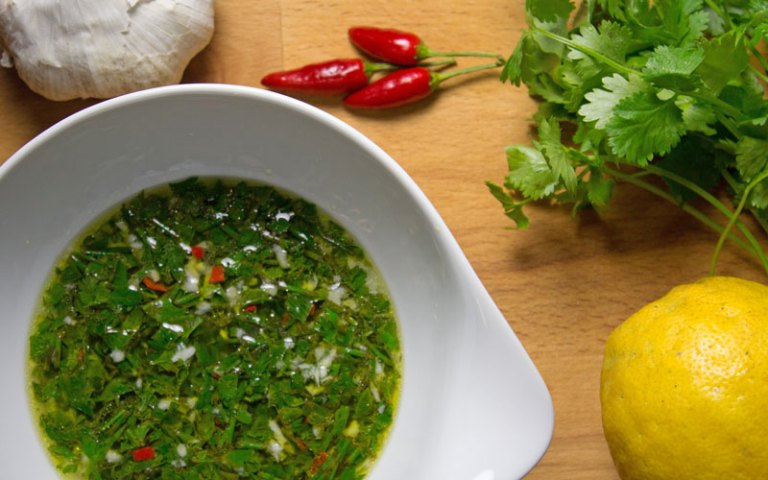

---
image: ../pics/sauce-chien.jpg
---
# Собачий антильский соус \| Sauce chien à l’antillaise

Почему собачий? Есть две версии. Первая: все ингредиенты на соус изначально рубились ножом, который назывался "chien" \(что в переводе означает "собака"\). Вторая версия: название пошло от западно-индийской фразы "Собака!" , обозначающей что-то вкусное

#### Ингредиенты:

* сок 2 лаймов
* 2 ст.л. подсолнечного масла
* петрушка
* 2 зубчика чеснока
* мелко рубленный чили-перец
* 3 молодых луковицы
* 150 мл кипятка

Все ингредиенты смешать, остудить. Соус подойдёт как к мясу, так и к рыбе.

_maria-cuisine.livejournal.com_

