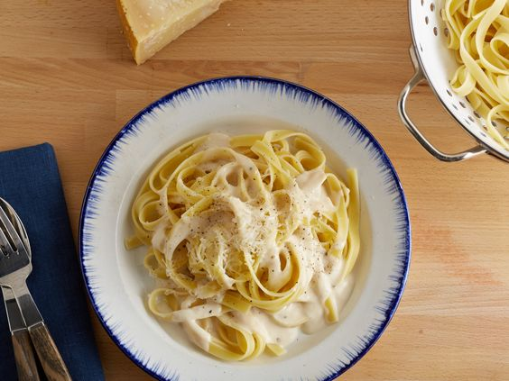

# Соус Альфредо \(Alfredo Sauce\)

#### Ингредиенты

* 1 ст. жирных сливок &gt; 32%
* 4 ст.л. сливочного масла
* 0,5 ст. тёртого пармезана
* соль, черный свежемолотый перец - по вкусу

#### Приготовление

В кастрюльке на небольшом огне нагреть вместе сливки и масло. Периодически помешивать до полного растворения масла.  
Добавить соль и перец \(учитывайте пикантность пармезана, который используете!\)  
Добавить соус к пасте, отваренной до состояния "al dente", посыпать пармезаном, перемешать.

*cobra-queens.livejournal.com*
