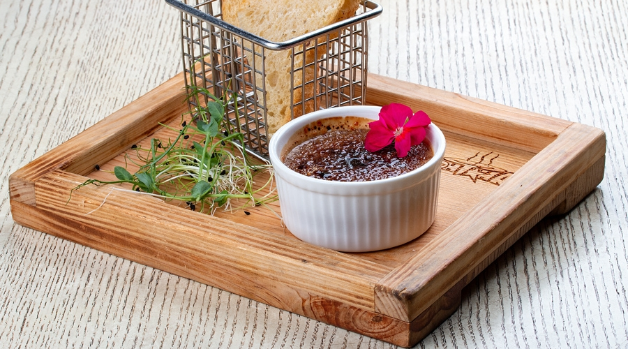

---
image: ../pics/creme-brulee-lever.jpg
---
# Крем-брюле из печенки с инжиром

#### Ингредиенты

* телячья или свиная печень 500 г
* 150 грамм сливочного масла
* 2 крупных яйца
* 100 мл молока или пополам с кокосовым
* соль
* перец
* мускатный орех щепотка

#### Приготовление

Печень на сутки замочить в молоке, нарезать кусочками, выложить в блендер и хорошенько измельчить. Растопить и остудить масло, добавить к измельченной печенке. Слегка взбить яйца и добавить к печени. Туда же налить молоко, соль, перец и мускатный орех. 

Тщательно перемешать, пропустить через сито и разложить по порционным формочкам, граммов по 100. Внутрь каждой формочки вложить дольку инжира. 

Отправить печенку в разогретую до 100 градусов духовку на 40 минут, полностью остудить и убрать в холодильник. Посыпать тростниковым сахаром и обжечь горелкой до карамельной корочки

 _Дмитрий Геращенко, шеф-повар ресторана «Сыроварня» в парке Горького_
