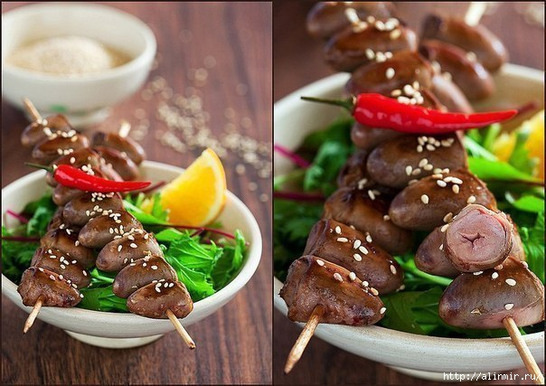

# Куриные сердечки на шпажках

#### Ингредиенты:

* 600 гр куриных сердечек
* 2 ст. ложки апельсинового сока
* 2 ч. ложки лимонного сока
* 2 ст. ложки соевого соуса
* 2 зубчика чеснока
* 2 ч. ложки растительного масла
* перец чили
* корень имбиря
* свежемолотый черный перец
* семена кунжута

#### Приготовление:

У сердечек обязательно отрезать отрытую часть, она довольно жирная и выглядят они так аккуратнее. Промыть сердечки от сгустков крови, внутри их много. Замочить сердечки в ледяной воде на 30 минут, вновь тщательно промыть, обсушить. 

Чеснок измельчить, перец чили крупно нарезать, удалив семена, корень имбиря натереть. 

В контейнере с крышкой смешать апельсиновый и лимонный сок, соевый соус, чеснок, чили, имбирь, черный перец. Выложить в маринад сердечки, тщательно перемешать, накрыть крышкой и убрать в холодильник на 2-3 часа. В процессе маринования несколько раз перемешать сердечки. 

Освободить сердечки от маринада, нанизать на деревянные шпажки. Обжарить сердечки со всех сторон на сковороде с антипригарным покрытием в двух чайных ложках растительного масла. 

Вынуть шпажки с сердечками из сковороды, сковороду дегласировать белым сухим вином, водой или апельсиновым соком \(1-2 ст. ложки\), вернуть сердечки в сковороду, готовить еще пару минут, все время переворачивая шпажки. Сразу же подать к столу, посыпав жареными семенами кунжута, гарнировав зеленым салатом.

[_http://laperla-foto.livejournal.com/135600.html_](http://laperla-foto.livejournal.com/135600.html)

