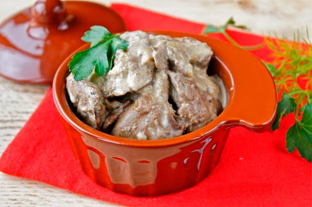

---
image: ../pics/sacivi-lever.jpg
---
# Сациви из печени

#### Ингредиенты

* говяжья печень
* кориандр
* хмели-сунели
* красный перец
* соль
* кинза
* гранат

**для соуса:**

* лук
* сливочное масло
* горсть грецких орехов
* мясной бульон

#### Приготовление

Печень нарезать крупно стейками в пару сантиметров толщиной. Замариновать в смеси кориандра, хмели-сунели, красного перца и соли, оставить на 10 минут

Выложить на раскаленную сковороду и обжарить с двух сторон так, чтобы внутри оставался розовый сок, и нарезать поперек ломтиками. 

Отдельно приготовить соус баже: обжарить до легкой золотистости тонко нарезанную луковицу на сливочном масле, добавить горсть измельченных грецких орехов, перетереть толкушкой и разбавить бульоном до состояния жидкой сметаны. Прогреть соус и залить им печень. Посыпать свежей кинзой и зернами граната. 

Есть можно, когда печень теплая, но остывшей она будет еще лучше

_Максим Тарусин, шеф-повар ресторана «Восход»_
