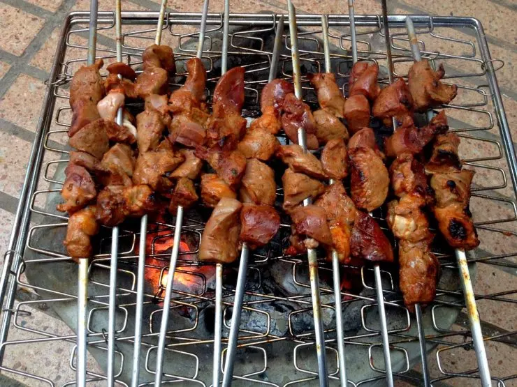

---
image: ../pics/kouah-liver-brochettes-nada-740x555.jpg.webp
---
# Шашлычки из печени с имбирем

#### Ингредиенты:

* говяжья печень
* 1 яичный белок
* 1 ст л кукурузного крахмала
* 1 ст л мирина или рисового вина
* 2 ст л соли
* 2 ст л тертого имбиря
* опционально грибы или чернослив

#### Приготовление:

Для маринада смешайть белок, крахмал, мирин, соль и тертый имбирь, взболтать вилкой.

Печень нарезать кубиками в 2–2,5 см \(пленки и все протоки в процессе нарезки нужно изъять\), выложить в маринад, оставить в холодильнике на час. 

Нанизать печень на шпажки и жарить на хорошо смазанной маслом решетке, хотя можно и на сковороде. Маринад образует поджаристую белковую корочку, которая не даст печени подсохнуть. Для пробы разрезать один из кусочков — внутри должно быть все розовато-серым и сочным

_Алексей Беседин, бренд-шеф ресторнов Il forno_ [_https://eda.ru/media/produkt/pechen-govyazhya-telyachya-svinaya_](https://eda.ru/media/produkt/pechen-govyazhya-telyachya-svinaya)

