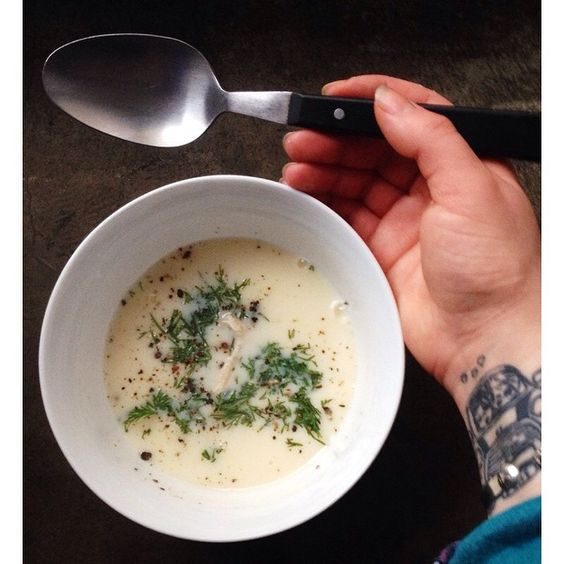

---
image: ../pics/avgolemono.jpg
---
# Авголемоно \| Avgolemono

#### Ингредиенты

2 порции

* куриные бедра 4 шт
* куриный бульон 500 мл
* 1 луковица
* итальянские травы 1 ч л
* чеснок 5 зубчиков
* 1 морковь
* рис круглый 100 г
* лавровый лист
* укроп, петрушка
* соль, перец по вкусу
* оливковое масло для подачи 

**для соуса авголемоно:**
* 2 желтка
* сок 1 лимона
* лимонная цедра

#### Приготовление

Обжарить куриные бедра, отложить в кастрюлю. Овощи нарезать, обжарить в той же сковороде, добавив травы. Добавить в кастрюлю овощи, лавровый лист и бульон, довести до кипения, уменьшить огонь и варить около 40 минут.

Вынуть курицу и остудить. Рис промыть, всыпать в бульон, довести до кипения, готовить под крышкой до готовности риса на слабом огне.

Остывшую курицу разобрать на волокна или нарезать кубиком.

Приготовить соус. Взбить венчиком желтки с лимонным соком до состояния однородной эмульсии, влить половник едва тёплого бульона, снова взбить, влить в суп помешивая, посолить, поперчить, прогреть, не доводя до кипения.

Добавить куриное филе и нарезанную зелень.

Подавать с оливковым маслом.
