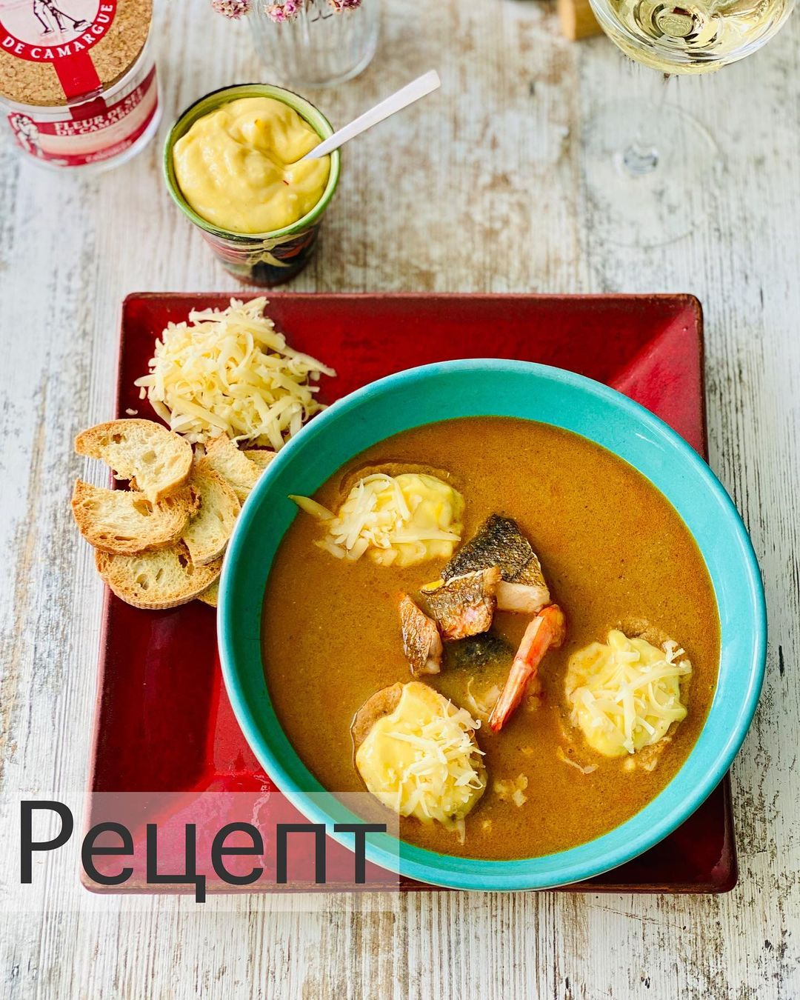

---
image: ../pics/buaibes.jpg
---
# Буайбес

Буайбес - рыбный суп из Прованса. Изначально это был суп рыбаков из того, что приплыло им в сети. А сейчас он стал частью гастрономической кухни

#### Ингредиенты

* мелкая морской рыбы (или кости+головы+филе крупной) 1 кг
* морковь 1 шт
* фенхель 1 шт
* апельсин 1 шт
* чеснок 1 головка
* свежий тимьян
* лавровый лист
* звездчатый анис (бадьян)
* оливковое масло
* пастис (анисовая водка, вместо неё можно увеличить количество бадьяна + немного коньяка)
* шафран + паприка + острый красный перец (эспелет)
* помидоры 2-3 шт
* томатной пасты 2 ст л
* белое сухое вино 0,5 л
* средний картофель 3-4 шт
* разная морская рыба и морепродукты (опционально)
* подсушенный багет
* тёртый сыр (типа эмменталь)
* соус (домашний майонез + зубчик чеснока + шафран)

#### Приготовление

Мелкую рыбу промыть, крупную выпотрошить и нарезать. В большую кастрюлю поместить рыбу, средне-порезанные морковь, фенхель, раздавленный чеснок, порезанный на части апельсин, лавровый лист, тимьян, бадьян, приправу, оливковое масло и пастис. Замариновать на ночь.

Обжарить ингредиенты минут 10, добавить помидоры и томатную пасту. Добавить вино и воду, чтобы жидкость покрыла ингредиенты. Добавить средне порезанный картофель. Варить около 30 минут, проверить готовность картофеля.

Удалить бадьян, апельсин, лавровый лист, тимьян. 3-4 кусочка картофеля отложить на соус. Пробить блендером. Процедить, хорошо отжимая.

Приготовить майонез с давленым зубчиком чеснока, шафраном и мятым вилкой картофелем из супа. Рыбу обжарить на сковороде.

Подавать суп с рыбой, отдельно соус, сыр и багет.

*ig: foodedlife*
