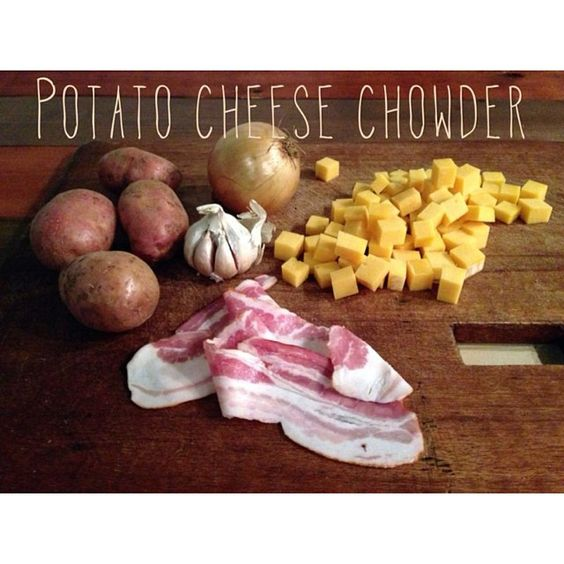

# Чаудер с беконом

#### Ингредиенты:

* 2 столовые ложки несоленого сливочного масла
* 3 маленькие морковки
* 1 крупная луковица
* 2 стакана куриного или овощного бульона
* 6 картошек
* 1 столовая ложка свежих листьев тимьяна или 1 чайная ложка сушеных
* 2 ¼ чашки молока
* ½ чайной ложки соли
* 1 столовая ложка нарезанных свежих листьев петрушки плюс еще для украшения
* 1 щепотка кайенского перца
* 1 чайная ложка свежемолотого черного перца
* 2 столовые ложки кукурузного крахмала
* 1 чашка тертого сыра чеддер

#### Приготовление:

В большой кастрюле растопить масло на среднем огне. Добавить морковь и лук, обжарить 3-5 минут или до мягкости. Добавить бульон, картофель и тимьян. Готовить на среднем огне 15 минут или пока картофель не станет мягким. Размять примерно ⅓ картофеля, чтобы он загустел. Уменьшить огонь и добавить 2 чашки молока, соль, петрушку, кайенский перец и черный перец.

В небольшой миске взбить оставшиеся 1/4 чашки молока с кукурузным крахмалом до однородной массы, медленно влить в суп и нагреть до загустения и образования пузырей. Снять с огня, добавить 1 чашку тертого сыра, растопить. 

Подавать немедленно. При желании украсить каждую порцию тертым сыром, ложкой сметаны, петрушкой, чесноком и рубленым беконом.

