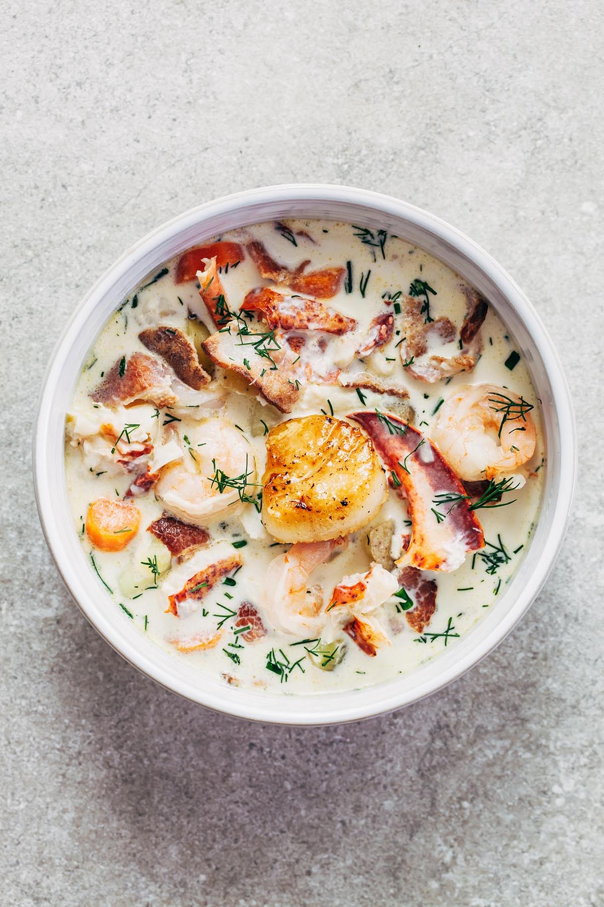

---
image: ../pics/nova-scotia-seafood-chowder-21-1-.jpg
---
# Чаудер с морепродуктами

#### Ингредиенты:

* Морепродукты разные какие найдете 500 г
* Бекон 200 г
* Репчатый лук 1 штука
* Пшеничная мука 1 столовая ложка
* Морковь 1 штука
* Куриный бульон 250 мл
* Молоко 900 мл
* Картофель 700 г
* Лавровый лист 2 штуки
* Сливки 20% 250 мл
* Соль по вкусу
* Молотый черный перец по вкусу

#### Приготовление:

Нарезать бекон небольшим кубиком, в большой кастрюле на маленьком огне вытопить жир и подрумянить бекон. 

Мелко нарезать лук и морковь, добавить к бекону и обжарить в масле помешивая около трех минут. Когда овощи размягчатся, добавить к ним муку и готовить, помешивая, еще 2 минуты. 

Затем добавить картофель, нарезанный небольшим кубиком, лавровый лист, молоко и бульон. Варить до мягкости картофеля

Добавить в суп нарезанные морепродукты, довести до кипения. Влить сливки, перемешать, поварить еще пару минут, посолить и поперчить суп по вкусу.

[_https://eda.ru/recepty/supy/chauder-93301_](https://eda.ru/recepty/supy/chauder-93301)

