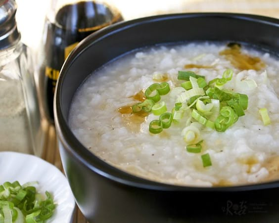

---
image: ../pics/chicken_congee.jpg
---
# Рисовый cуп с курицей \| Chicken Congee

#### Ингредиенты:

* рис круглый 160 г 
* вода 1 л
* растительное масло 1 ст л
* соль по вкусу

**для маринада:** 

* филе курицы 200 г
* имбирь 15 г
* сахар 1 ч л
* светлое кунжутное масло 1 ст л
* кукурузный крахмал 1 ст л
* черный перец, соль по вкусу

#### Приготовление:

Курицу нарезать кубиками, натереть имбирь, смешать все ингредиенты для маринада, оставить на 30 минут.

Налить в кастрюлю воды, добавить растительное масло, соль, рис, варить на медленном огне 30 минут,чтобы рис слегка переварился. После добавить маринованное куриное мясо,варить помешивая 10 минут.

Добавить рубленый зеленый лук. Подавать с соевым соусом и кунжутным маслом

_Источник: книга Aysha Bahlool (китайская кухня)_
