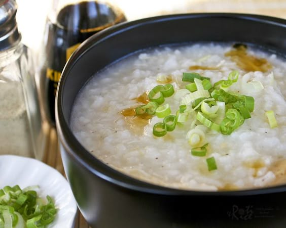

---
image: ../pics/chicken_congee.jpg
---
# Рисовый cуп с курицей \| Chicken Congee

Chicken Congee - китайский рисовый суп или каша с курицей.

#### Ингредиенты

* рис круглый 160 г 
* куриный бульон 1,5 л
* растительное масло 1 ст л
* соль по вкусу

**для маринада:** 

* филе курицы 200 г
* имбирь 15 г
* сахар 1 ч л
* светлое кунжутное масло 1 ст л
* кукурузный крахмал 1 ст л
* черный перец, соль по вкусу

#### Приготовление

Курицу нарезать, мелко натереть имбирь, смешать все ингредиенты для маринада, оставить на 30 минут. Запечь курицу под грилем.

Бульон довести до кипения, добавить растительное масло, соль, рис, варить на медленном огне 30 минут,чтобы рис слегка переварился.

Подавать сразу или доготавливать в момент подачи. Для подачи добавить в суп готовую курицу, зеленый лук, соевый соус, кунжутное масло.

_Источник: книга Aysha Bahlool (китайская кухня)_
