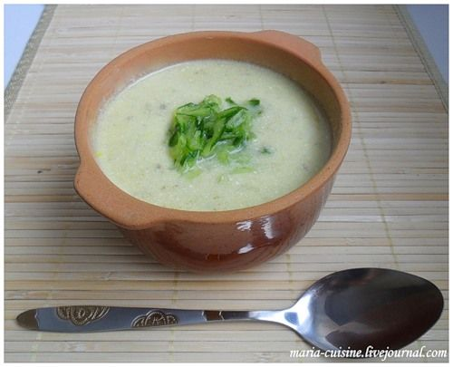

# Крем-суп из огурца \| Crème de concombre

## Ингредиенты:

2 порции \| 40 мин

* 1 длинный огурец \(или 2 средних\)
* 1 маленькая луковица
* 450 мл куриного бульона или воды
* 1 ч.л. лимонного сока
* 3-4 ст.л. сметаны
* 15 г сливочного масла
* соль, перец

#### Приготовление:

Оставить 1/3 огурца для украшения.

2/3 огурца порезать кубиками. Лук очистить и мелко нарезать.

В кастрюле растопить сливочное масло и обжарить лук и огурец 5 минут на медленном огне. Добавить бульон, перемешать.

Довести до кипения и варить на медленном огне 20 минут под крышкой.

Пюрировать суп блендером. Добавить лимонный сок, соль, перец.

Добавить сметану, хорошо перемешать. Оставшуюся 1/3 огурца натереть на тёрке и при подаче разложить в суп.

Суп можно есть горячим и холодным!

_maria-cuisine.livejournal.com_

