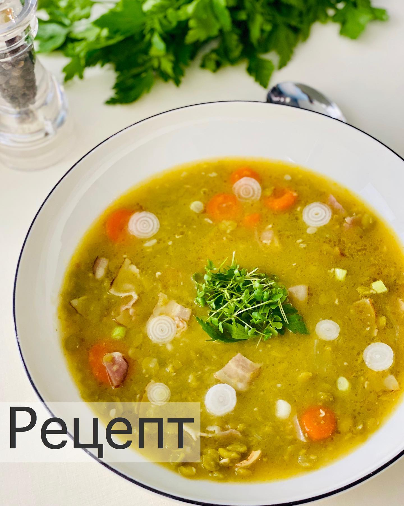

---
image: ../pics/goroh.jpg
---
# Гороховый суп

#### Ингредиенты

* бульон 1 л
* бекон или копченая грудинка 150 г
* 1 лук
* 1 морковь
* чеснок 4 зубчика
* зеленый колотый горох 400 г

#### Приготовление

Морковь, чеснок и бекон нарезать средне.  
В кастрюле обжарить бекон, добавить лук и чеснок, немного обжарить. Добавить морковь, обжарить ещё пару минут.  
Добавить горох. Добавить бульон.  
Довести до кипения и варить до готовности и нужной консистенции гороха, минут 40-50.  
Посолить в конце варки.

*ig: foodedlife*
