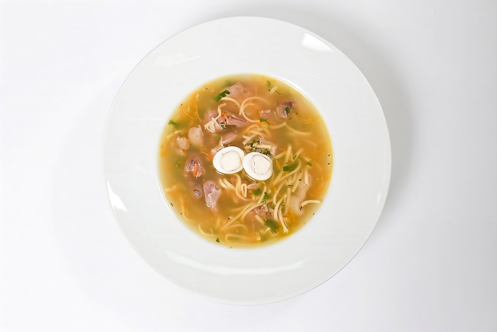

# Куриный суп с потрохами

#### Ингредиенты

4 порции

* Куриные желудки 260 г
* Куриные сердца 260 г
* Куриная печень 260 г
* Репчатый лук 40 г
* Морковь 20 г
* Перепелиное яйцо 4 штуки
* Яичная лапша 80 г
* Куриный бульон 800 мл
* Петрушка 20 г
* Укроп 20 г
* Растительное масло 2 ч л
* Соль, перец по вкусу

#### Приготовление

Куриные потроха промыть и очистить от пленок и жира. Положить каждый вид в отдельную кастрюлю, залить холодной водой, поставить на огонь, по­солить, поперчить и довести до кипения. С этого момента печень нужно варить двадцать-двадцать пять минут, сердца — сорок минут, а желудкам понадобится около часа.

Морковь мелко натереть, репчатый лук нарезать маленькими кубиками. Разогреть на сковороде немного масла, выложить в нее овощи и пассеровать, постоянно помешивая, две-три минуты. Переложить морковь с луком на тарелку, проложенную бумажной салфеткой, чтобы снять излишки масла.

Заранее сваренный куриный бульон перелить в кастрюлю, выложить в него потроха и довести до кипения. Добавить лук и морковь, а затем всыпать яичную лапшу — можно ее поломать, чтобы удобнее было есть суп. Попробовать бульон и, если нужно, посолить и поперчить.

Мелко нарезать петрушку и укроп. Примерно через три ми­нуты, после того как в бульо­не очутилась яичная лапша, пере­ложить в него зелень. А еще через пару минут огонь можно будет погасить: ориентироваться надо на готовность лапши.

Готовый суп-лапшу с потроха­ми разлить по тарелкам и положить в каждую порцию вареное перепелиное яйцо, разрезанное пополам.

_eda.ru_
