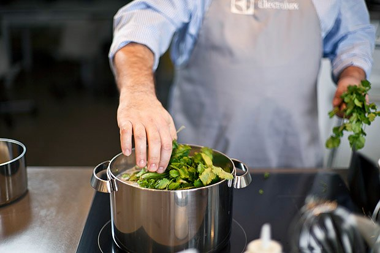

# Чихиртма

Грузинская кухня.

Притом что чихиртма — чисто грузинское блюдо, этот суп — прозрачный и жидкий, как в большинстве европейских кулинарных традиций.

Этот суп имеет целебные свойства. Известно, что французский луковый суп выписывают при бронхите. Так же и чихиртма — суп идеально помогает от простуды и похмелья.

## Ингредиенты:

6 порций \| 1 ч. 20 мин

* Курица - 1 шт 
* Луковица - 5 шт.
* Яйцо - 1 шт
* Кинза с корешками - 1 пучок
* Винный уксус - 2 ст. ложки
* Молотый кориандр - 1 ч. ложка

## Приготовление:

Курицу помыть, разделать и порезать на куски, не снимая кожи. Вырезать из-под кожи куриный жир — он пригодится для тушения курицы.

Почистить и мелко нарезать лук.

Растопить куриный жир в кастрюле на максимальном огне. Добавить в кастрюлю лук. Тушить, пока лук не побелеет и не даст аромат.

Разложить куски курицы в кастрюле и перемешать с луком. Уменьшить огонь до среднего. Тушить еще 20 минут.

 

Через 20 минут наполнить кастрюлю водой и закрыть крышкой. Довести воду до кипения на максимальном огне. Тщательно промыть кинзу и добавить целый пучок в суп.

Через час достать из супа курицу и процедить суп через сито. Дать бульону остыть 5–10 минут.

Пока остывает бульон, отделите желтки от белков — для супа понадобятся только желтки.

Размешать суп, чтобы образовалась воронка, и влить в нее желтки тонкой струйкой.

Добавить в суп соль, две столовые ложки винного уксуса и щепотку кориандра.

Разлить суп по тарелкам и украсить зеленью кинзы. Подавать с рюмкой крепкого алкоголя.

[_http://www.the-village.ru/village/food/chief-at-home/125293-shef-doma-gruzin-i-italyanets-gotovyat-po-retseptam-babushek_](http://www.the-village.ru/village/food/chief-at-home/125293-shef-doma-gruzin-i-italyanets-gotovyat-po-retseptam-babushek)\_\_

