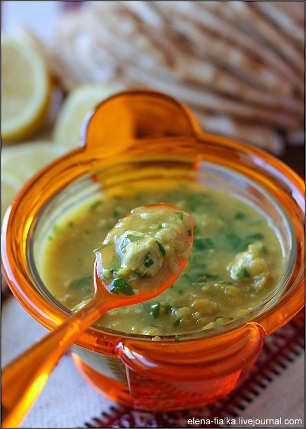

---
image: ../pics/2061c53a2d8dea7b85631651b33a6b5d-1.jpg
---
# Куриный суп с чечевицей и овсянкой

#### Ингредиенты:

* 1 куриное филе
* 1/3 ст оранжевой чечевицы
* 6 ст.л овсяные хлопья быстро приготовления
* 1 маленькая луковица
* 1 зубчик чеснока
* 1 литр воды

## Специи:

* Молотая зира 1/3 ч.л
* Куркума ½ ч.л
* Черый перец 1/3 ч.л или по вкусу
* Соль по вкусу
* Зелень кориандра или петрушки
* Лимон 

#### Приготовление:

Куриное филе нарезать мелкими кубиками.Лук и чеснок измельчить.Чечевицу промыть и откинуть на сито.

Раскалить масло в кастрюле с толстым дном.Добавить лук,чеснок,специи и поджарить около минуты.Добавить кусочки куриного филе,обжарить всё вместе.Добавить чечевицу и овсянные хлопья,перемешать.

Налить кипящей воды.Приправить солью.Варить до готовности чечевицы.

Готовое блюдо посыпать зеленью кориандра.Отдельно подать порезанный на 4 части лимон или лимонный сок.

[_http://elena-fialka.livejournal.com/144930.html_](http://elena-fialka.livejournal.com/144930.html)

