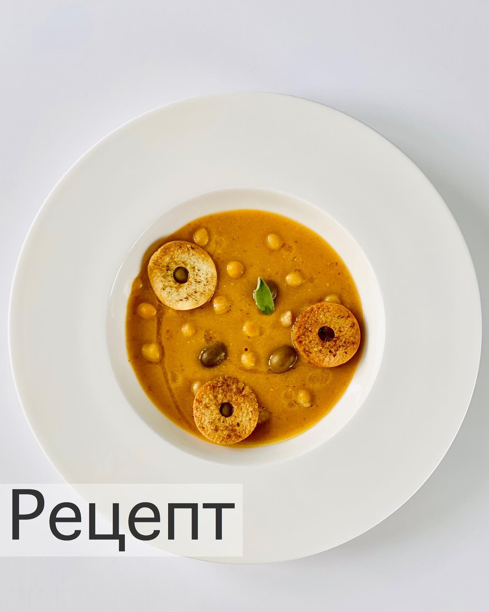

---
image: ../pics/lablabi.jpg
---
# Лаблаби

#### Ингредиенты
на 2-3 порции

* нут 300г
* чеснок 2-3 зубчика
* ветка шалфея
* бульон овощной или куриный или вода
* харисса или аджика 1 ч л
* кумин (зира) в порошке
* лимон
* оливковое масло
* тостовый хлеб
* оливки

#### Приготовление

Накануне замочить нут в воде.

Чеснок мелко порезать, обжарить в кастрюле на оливковом масле без изменения цвета. Добавить нут без жидкости, пару листиков шалфея. Немного нута отложить для подачи.

Залить бульоном и варить до готовности нута. Посолить в конце варки. Пробить блендером, добавив хариссу, лимонный сок и кумин. Процедить через сито. Добавить бульон до нужной консистенции, выправить вкус на специи.

Тостовый хлеб порезать на сухарики. Полить оливковым маслом, посыпать кумином и отправить запекаться в духовку до золотистого цвета.

При подаче суп полить оливковым маслом, добавить отложенный нут, еще немного лимонного сока, оливки и сухарики.

*ig: foodedlife*
