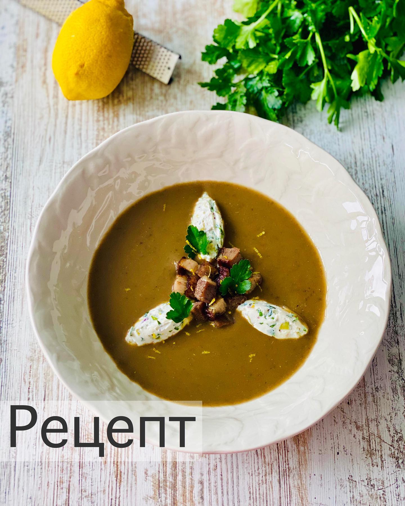

---
image: ../pics/lentil-ricotta.jpg
---
# Чечевичный суп с рикоттой и фисташками

#### Ингредиенты
на 4 порции
* зеленая чечевица 200 г
* копченая грудинка 150 г
* 1 морковка
* 1 гвоздичка
* чеснок 2 зубчика
* тимьян 1 веточка 
* петрушка пара крупных веток
* 1 лавровый лист
* бульон 1 л
* сливки 100 г
* фисташки 2 ст л
* рикотта 150 г
* оливковое масло 1 ст л
* лимон

#### Приготовление

Чечевицу промыть. Морковь нарезать средне. В лук воткнуть гвоздику. Стебли петрушки мелко нарезать.

В кастрюле смешать чечевицу, кусок грудинки, морковь, лук, стебли петрушки, чеснок. Залить бульоном и довести до кипения. Добавить лавровый лист и тимьян. Варить до готовности чечевицы (посолить в конце).

Из супа удалить гвоздику, лавровый лист и тимьян. Грудинку отложить.

Пробить суп блендером, затем лучше процедить через сито. Добавить сливки и довести до кипения. Грудинку порезать кубиком и обжарить на сковороде.

Смешать рикотту, оливковое масло, рубленую петрушку и фисташки. Добавить немного лимонного сока по вкусу.

Подавать суп + грудинка + рикотта + лимонная цедра.

*ig: foodedlife*
