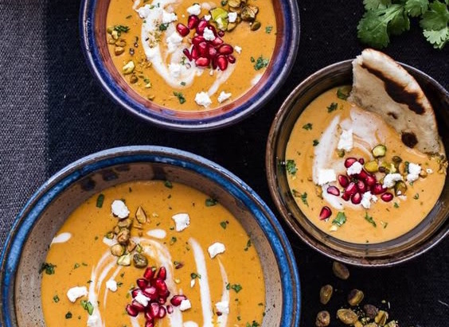

# Марроканский суп из тыквы с козьим сыром, кремом из имбиря и фисташками

#### Ингредиенты:

4 порции | 60 мин

* 1 головка чеснока
* кокосовое масло 2 ст л
* тыква баттернат 700 г
* порошок карри 1 ч л
* копченая паприка 1 ч л
* тмин 1/2 ч л
* молотая корица 1/2 ч л
* кайенский перец 1/2 ч л
* свежий тимьян
* кокосовое молоко 400 г
* овощной бульон 450 г
* соль и перец по вкусу
* козий сыр 110 г
* кинза, гранат и фисташки для украшения
* лепешки Naan для подачи

**для крема из имбиря:**

* кокосовое молоко 120 г
* свежий имбирь 30 г

#### Приготовление:

Разогреть духовку до 200 °C

Срезать верхнюю часть головки чеснока, снять всю шелуху. Налить на зубчики немного оливкового масла и накрыть фольгой. Запекать 45 минут пока чеснок не станет мягким и золотисто-коричневого цвета. Вынуть из духовки и остудить пять минут. Выдавить чеснок в небольшую миску и хорошо размять вилкой.

В то же время налить кокосовое масло в кастрюлю и поставить на средний огонь. Добавить красный перец и тушить 3-5 минут до мягкости. Добавить тыкву, пряный порошок карри, копченую паприку, тмин, корицу, кайенский перец и тимьян. Приправить солью и перцем.

Готовить 3-5 минут, затем влить кокосовое молоко и бульон. Довести суп до кипения, уменьшить огонь, накрыть крышкой и варить на медленном огне 20-25 минут или пока тыква не размягчится в пюре.

Пока суп варится, сделать имбирный крем. Смешать холодное кокосовое молоко и 1 столовую ложку имбиря в небольшой миске. Попробовать и добавить больше имбиря, если это необходимо. Накрыть и оставить в холодильнике.

Как только тыква приготовится добавить жареный чеснок и козий сыр в суп. Снять кастрюлю с плиты и немного остудить, затем протереть суп в блендере. Вернуть суп на плиту и прогреть.

Для подачи разлить суп по глубоким мискам, добавить имбирный крем и немного размешать. Украсить нарезанной кинзой, рубленными фисташками, козьим сыром и зернами граната. Подавать с горячими лепешками Naan.

*halfbakedharvest.com*
