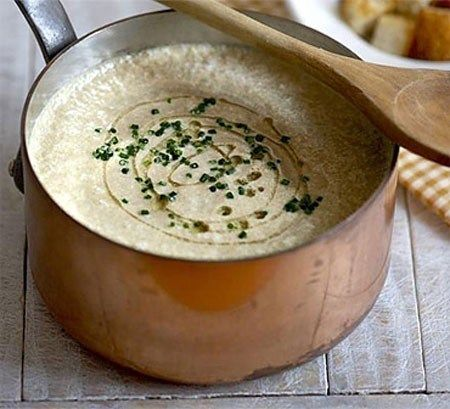

---
image: ../pics/mushroom-cream.jpg
---
# Крем-суп из шампиньонов

#### Ингредиенты:

6 порций

* свежие шампиньоны 500 г
* сливки 25% 300 мл
* сливочное масло 2 ст л
* пшеничная мука 3 ст л
* оливковое масло 2 ст л
* тимьян щепотка
* чеснок 1 зубчик
* соль, свежемолотый черный перец по вкусу
* сушеные белые грибы 2 штуки

#### Приготовление:

Шампиньоны тщательно вымыть, 2 красивых крепких гриба отложить. Отделить ножки и порубить их крупно. Шляпки нарезать тонкими ломтиками.

Ножки положить в кастрюлю, залейте 1-1,5 л. холодной воды, добавьте тимьян и неочищенный зубчик чеснока. Довести до кипения, варить на небольшом огне под крышкой 30 минут.

В большой сковороде разогреть треть оливкового масла, положить нарезанные шляпки, посолить, закрыть крышкой. Готовить на сильном огне, потряхивая сковороду, 5 мин. Открыть крышку - в сковороде должен образоваться грибной сок. Аккуратно вычерпать его в кастрюлю, где варятся ножки. Добавить оставшееся оливковое масло, перемешать и обжарить, помешивая, ещё 10 мин.

Готовые шляпки выложить в кастрюлю с ножками за 5-10 мин до конца варки (тимьян и чеснок удалите). Отлить примерно 1 стакан бульона и слегка остудить.

Пока грибы довариваются, в небольшом сотейнике растопить сливочное масло, добавить муку, обжарить на небольшом огне, всё время помешивая, 3-4 мин, не доводя до карамелизации и появления золотистого цвета, она должна остаться максимально светлой. Снять сотейник с ру с огня и влить в него 240мл отложенного бульона тонкой струйкой, всё время помешивая венчиком до гомогенноого пастообразного состояния. Поставить бульон на средний огонь. Готовить, помешивая, чтобы не было комков, при необходимости добавить ещё бульона, 7-10 мин, доводя до консистенции холодных жирных сливок. После этого прогреть еще немного на маленьком огне до густоты.

Перелить суп в блендер, добавить заправку из сотейника, пробить до однородности и вернуть в кастрюлю.

Довести до кипения, влить сливки, прогреть, не давая кипеть, приправить солью и перцем, снять с огня, если есть ощущения высокого содержания жира, добавить несколько капель лимонного сока.

Для подачи отложенные шампиньоны нарезать тонкими ломтиками. Сухие белые грибы с сухим тимьяном растолочь в ступке в муку или смолоть в кофемолке. Разлить суп в подогретые тарелки, в центр выложить несколько ломтиков шампиньонов и посыпать порошком из белых грибов с тимьяном. Подавать немедленно.

_Рецепт взят из Книги Гастронома: Про супы, 2009_ 
