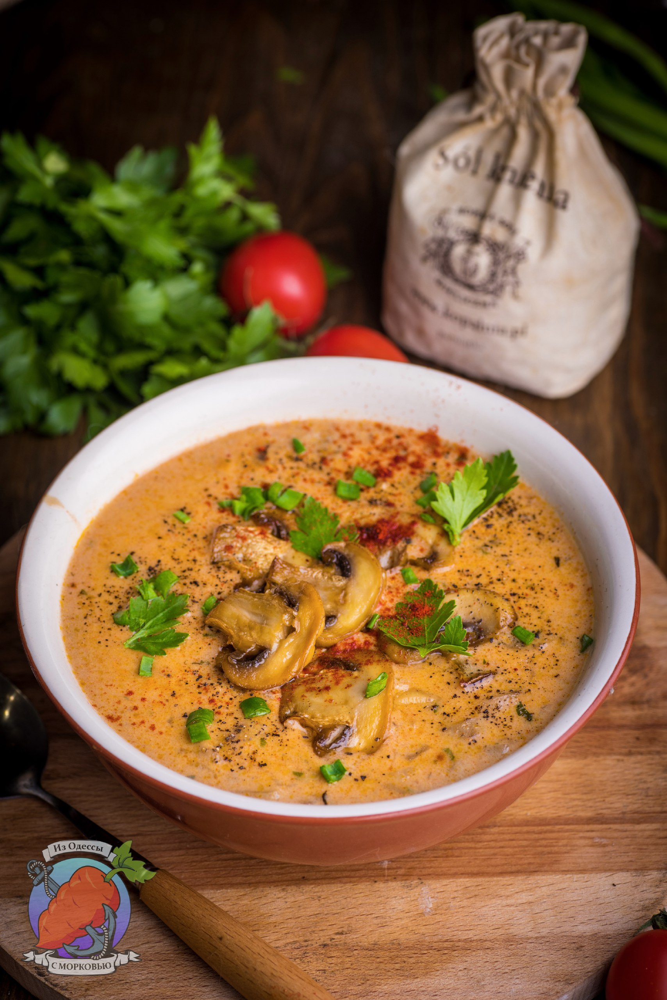

---
image: ../pics/mushroom-paprika.jpg
---
# Грибной суп с паприкой

#### Ингредиенты

* шампиньоны 600г + несколько штук для подачи.
* сливочное масло 50 г
* куриный бульон 1,5 л
* сладкая паприка 1,5 ст л
* копченая паприка 1 ч л
* сливки 20% 200 мл
* крахмал или мука 2 ст л
* лимонный сок 2 ч л
* петрушка
* черный или красный перец на выбор
* щепотка тимьяна

#### Приготовление

В сковороде растопить сливочное масло, добавить нарезанные ломтиками грибы и готовить 6-7 минут, помешивая. Влить бульон, добавить тимьян и паприку (кроме копченой). Довести до кипения и готовить 15 минут на минимальном огне под крышкой.

Отдельно смешать сливки и крахмал (или муку). Влить к супу и перемешать. Снова все довести до кипения и готовить еще 10-15 минут на самом минимальном огне.

Пока все готовится, поджарить грибы до красивого, золотистого цвета.

Добавить в суп нарезанную мелко петрушку, лимонный сок. Выровнять все на соль и перец. Добавить копченую паприку, если используете.

Для подачи добавить в суп сухарики, грибы, черный перец, петрушку и еще немного паприки. Можно добавить сметану.

*t.me/OdessaCarrot*
