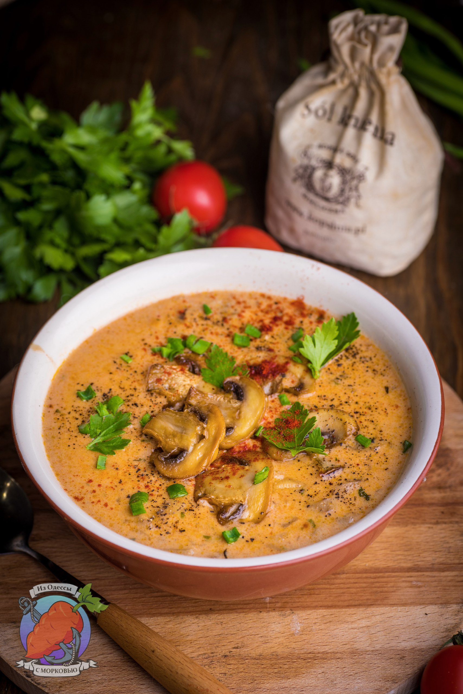

# Грибной суп с паприкой

#### Ингредиенты

* 600г шампиньонов + несколько штук для подачи.
* 2 средних луковицы
* 50г сливочного масла
* 1,5 л куриного бульона
* 1,5 стл сладкой паприки
* 1 ч.л копченой паприки
* 200 мл средних по жирности сливок
* 2 стл. крахмала или муки
* 2 ч.л. лимонного сока
* петрушка и зеленый лук
* черный или красный перец на выбор
* щепотка тимьяна

#### Приготовление

В сковороде растопить сливочное масло и добавить нарезанный мелким кубиком лук. Готовить 4-5 минут на среднем огне, пока он не размякнет и не станет полупрозрачным.  
Добавить нарезанные ломтиками грибы и готовить еще минут 6-7, помешивая.  
Влить бульон, добавить тимьян и паприку (кроме копченой). Довести до кипения и готовить 15 минут на минимальном огне под крышкой.

Отдельно смешать сливки и крахмал (или муку). Влить к супу и перемешать. Снова все довести до кипения и готовить еще 10-15 минут на самом минимальном огне.

Пока все готовится, поджарить грибы до красивого, золотистого цвета.

Добавить в суп нарезанную мелко петрушку, лимонный сок. Выровнять все на соль и перец. Добавить копченую паприку, если используете.

Для подачи добавить в суп сухарики, грибы, черный перец, петрушку и зеленый лук и еще немного паприки. Можно добавить сметану.

*t.me/OdessaCarrot*