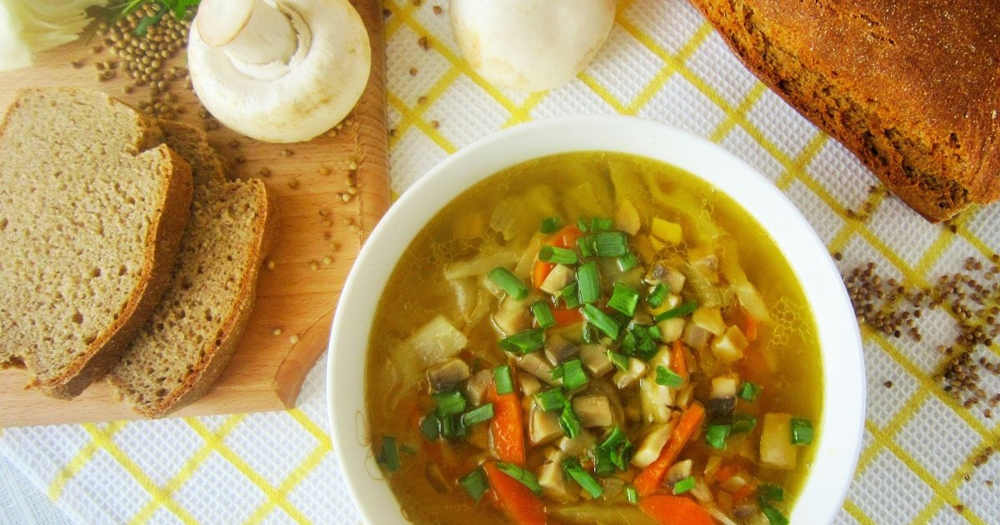

# Грибные щи с репой

#### Ингредиенты

* морковь 150 г
* головка чеснока
* лук
* репа
* бульон говяжий
* черный перец горошком 10 г
* душистый перец 6 г
* гвоздика 3 шт
* лавровый лист 2 шт
* петрушка
* тимьян свежий
* подосиновики 300 г
* лисички 300 г
* полба или перловка 70 г
* картофель 100 г
* соевый соус 50 мл
* сметана

#### Приготовление

Репу и морковь нарезать кубиками, обжарить на чесночном масле до готовности овощей. К кастрюлю налить бульон и добавить пряности, тимьян, веточки от петрушки, довести до кипения, добавить овощи. Добавить в бульон полбу, отварить до готовности. Промыть и почистить грибы, нарезать крупно, варить в бульоне до готовности. Добавить картофель, варить до готовности. Посолить, добавить соевый соус, нарезанную петрушку. Подавать со сметаной
