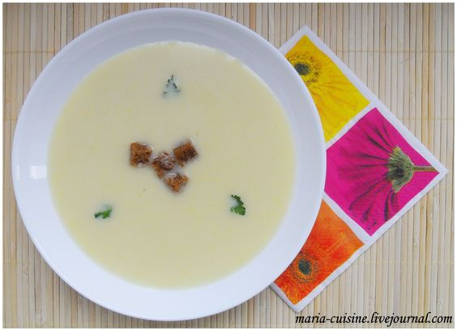

---
image: ../pics/potage_parmentier.jpg
---
# Крем-суп Пармантье | Potage Parmentier

#### Ингредиенты:

8 порций | 1 час

**основные ингредиенты:**

* масло сливочное 40 г
* картофель 800 г
* вода 1,8-2 л

**для завершения:**

* сливки 30% 200 мл
* петрушка или кервель 1/4 пучка
* масло сливочное 20 г

**для подачи:**

* хлеб тостовый 160 г
* масло сливочное 40 г
* соль

#### Приготовление:

Картофель почистить, помыть, нарезать на небольшие кубики и отложить в холодную воду. Растопить в кастрюле сливочное масло (40 г), обжарить лук-порей до прозрачности. Залить водой. Посолить. Добавить кубики картофеля.

Довести до кипения и варить на медленном огне под крышкой до готовности картофеля. Хлеб порезать мелкими кубиками 1х1 см и обжарить на масле (40 г). Отложить на бумажное полотенце. Пюрировать суп (мельницей для овощей, перетереть через сито или блендером с насадкой для пюре, обычная насадка блендера превращает картофель в клейстер). При необходимости процедить через сито. Добавить сливки.

Вернуть суп на огонь и довести до кипения. Снять с огня и положить на поверхность супа сливочное масло (20 г), закрыть крышку и дать маслу растаять. Суп перемешать, разлить по тарелкам, украсить кервелем и кубиками хлеба.

_lg: maria-cuisine_

