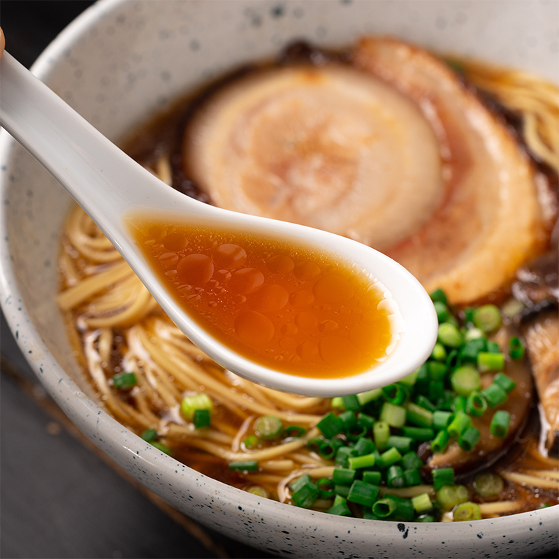

---
image: ../pics/ramen.jpg
---
# Рамен \| Ramen

Элементы рамена: бульон, лапша, яйцо, мясо и заправки-посыпки, которые добавляются в блюдо перед самой подачей.

## Рамен. Собираем к подаче

Кроме бульона, мяса, лапши и яиц, наиболее часто в рамен добавляют белую пасту мисо с соевым соусом, нарезанные нори и зеленый лук. У белой мисо самый короткий период ферментации и самый нежный и деликатный из всех мисо вкус.

#### Ингредиенты:

* Бульон 240-250 мл
* Яйцо 1 штука
* Часю 1 порция, 3-4 тонких ломтика
* Лапша 1 порция
* Нори 1 листик
* Мисо 1 ч л 
* Соевый соус 1 ст л 

**Приготовление:**

Довести до бурного кипения воду для варки лапши. Вода должна быть соленой как морская. Разогреть бульон. Подготовить миски по количеству порций.

Если порций 2-3, то мисо и соевый соус отмерить в каждую миску. Если порций много, например 10, то лучше смешать венчиком мисо и соевый соус в одной миске и затем распределить порционно. Если есть под рукой, то можно добавить по несколько капель ароматного темного кунжутного масла и пасты Юзу-коше \(смесь цедры японского цитруса Юзу и свежих зеленых чили\) размером с горошину.

Подготовить все остальные составляющие: разогреть яйца в бульоне и разрезать пополам, нарезать тонкими ломтиками мясо, нарезать лук и нори.

Отправить в воду лапшу и варить в бурно кипящей воде 2-3 минуты. Откинуть лапшу на сито, дать стечь воде и тряхнуть пару раз ситом, чтобы ушли последние капли воды. Распределить порции лапши по мискам и перемешать ее тщательно со смесью мисо и соевого соуса.

Залить лапшу бульоном. Разложить поверх мясо, яйца, посыпать луком и нарезанной нори.

Рамен едят палочками и ложкой или только палочками, низко наклоняясь над миской. Палочками вынимают лапшу и шумно, с прихлюпыванием втягивают губами. Палочки предназначены и для всего остального в миске, кроме бульона. Бульон едят ложкой или периодически пьют прямо из миски, держа ее двумя руками.

## Рамен. Бульоны

Есть три основных типа бульона для рамена по ингредиентам: даси, куриный и свиной.

Даси готовится из сухих водорослей конбу и стружки высушенного копчёного тунца-бонито, которая называется катсуобуси.

Готовится он, по сути, как чай, завариванием и настаиванием. Пахнет лесным дымком и океанской водой. С очень тонким и нежным вкусом и ароматом, низко калорийный, этот бульон часто используется в рецептах японской кухни. Только очень уважающие себя рестораны и повара используют настоящий способ приготовления даси. Все остальные растворяют в воде концентраты в виде порошка, гранул или жидкостей и даси готов.

Куриный и свиной бульоны для рамена характерны своей насыщенностью вкуса. И тот, и другой варятся, в отличие от аналогичных бульонов европейских кухонь, в бурно кипящей воде, чтобы вытянуть в бульон максимум вкуса из костей и хрящей, желировать и эмульгировать максимум коллагенов и жиров. В куриный и свиной бульоны добавляют всевозможные овощи, коренья и грибы шиитаке. Куриный бульон, разумеется, варится быстрее, чем свиной. Приготовление свиного бульона может достигать трех дней. Неудивительно, что большинство домашних вариантов базируется на даси, курином или фаршевом бульонах.

## Рамен. Куриный бульон

#### Ингредиенты:

4 порции

* Морковь 2 штуки
* Имбирь 2,5 см
* Куриные окорочка 4 штуки
* Соль морская 1 ч л 
* Кунжутное масло 2 ст л 
* Вода 4 литра

#### Приготовление:

Разогреть духовку до 235 С. Нарезать морковь и лук кусочками длиной 2 см. Очистить имбирь от кожицы и нарезать тонкими ломтиками. Уложить морковь, лук, имбирь и куриные окорочка в толстодонный чугунный сотейник, посыпать солью и сбрызнуть кунжутным маслом. Руками перемешать так, чтобы масло и соль равномерно распределились по их поверхности. Запекать 30-45 минут в центре духовки.

Переложить запеченные окорочка и овощи в кастрюлю с 4 литрами холодной воды и тщательно соскрести с дна чугунного сотейника все припеки и соки туда же. Довести до кипения на сильном огне, снизить жар до минимума и оставить тихонько кипеть под крышкой на 1 час.

Вынуть из бульона два окорока, переложить в отдельную миску, залить парой чашек горячего бульона из кастрюли и дать им медленно остыть до комнатной температуры. Отделить от костей мясо, разобрать его кусочками на один укус, залить бульоном и отставить. Кости разбить, вернуть в бульон и оставить кипеть не закрывая крышкой еще на 1 час.

## Даси. Бульон со вкусом моря

Бульон Даси - это один из базовых блоков японской кухни. Бульон Даси готовится очень быстро и просто из всего трех ингредиентов: воды, рыбной стружки и сухих бурых водорослей с широкими листьями. Как это обычно бывает, чем меньше в рецепте ингредиентов, тем важнее их качество и правильное с ними обращение.

Воду для Даси лучше использовать колодезную или бутылированную питьевую, то есть без химикатов и со средней кислотностью/щелочностью.

Если есть возможность выбора, то, по мнению знатоков, предпочтительны водоросли из холодных вод побережья острова Хоккайдо. Если выбора нет, то пробовать то, до чего есть возможность дотянуться и довериться собственному вкусу. В штатах в азиатских магазинах, водоросли встречаются в двух вариантах транслитерации на этикетках - Konbu и Kombu, от разных производителей разных стран Азии. Бурые водоросли - как и паста Мисо, соевый соус, сыр Пармезан, Прошуто, помидоры - насыщены природным глютаматом натрия, веществом, вкус которого японцы называют "умами".

Другая сторона вкусового комплекса вносится стружкой тунца бонито. Как и крупные виды тунца, бонито может развивать очень высокую скорость плавания, совершая рывки до 40 миль в час. Чтобы это было возможным, этой рыбе нужно снабжать мышцы АТФ \(Аденозинтрифосфат - источник энергии для множества энергозатратных биохимических и физиологических процессов\), который во время приготовления катсуобоси трансформируется в инозин монофосфат \(ИМФ\), который наши вкусовые рецепторы воспринимают с таким же восторгом, как и глютамат натрия. В разных источниках процесс производства катсуобуси описывают несколько по-разному. По сути, конечный вкус катсуобуси складывается во время многочисленных тепловых обработок бонито \(отваривания на низких температурах, копчения, вяления и высушивания\) и ферментации \(с помощью определенных видов плесени\). Процесс этот длится несколько месяцев и за это время соответствующие ферменты превращают протеины рыбы во вкусные аминокислоты. В результате, филе бонито превращаются в твердую массу, подобную ископаемому дереву. Не удивительно, что хлопья катсуобуси строгают с помощью устройства, похожего на рубанок.

#### Ингредиенты:

* сухие водоросли комбу 15 см
* стружка катсуобуси 3-5 г
* минеральная вода без газа 500 мл 

#### Приготовление:

Залить 500 мл холодной воды прямоугольник водорослей, приблизительно 15 на 15 см. На поверхности сухих водорослей есть белый налет - это морская соль, ее не нужно убирать. Если водоросли надрезать ножницами на полосочки крупной бахромой, комбу сможет себя отдать в воду лучше и останется цельной, вынимаемой в один захват.

Включить средний огонь под сотейником и довести воду почти до кипения, мелких пузырьков. Чем медленнее вода дойдет до этого состояния, тем больше вытянется вкуса из водоросли. В этот момент вынуть водоросль и выбросить. Уже на этом этапе начинает пахнуть морем, зеленью моря.

Всыпать стружку катсуобуси, оставив сотейник на маленьком огне на 8 минут, затем снять с огня и дать постоять еще 8 минут перед тем, как процедить бульон.

Часть воды впитывается водорослями и стружками при регидрации, поэтому после процеживания должно получиться около 300 мл бульона. Он будет светло желтого цвета, чуть мутный из-за взвешенных частиц. Они оседают при отстаивании. Это и есть Даси, бульон с ароматом и вкусом моря.

## Рамен. Свинина для Рамэна \(Часю, チャーシュー, Chāshū\)

Как и рамен, это блюдо пришло в японскую кухню из Китая и очень сильно трансформировалось. В оригинале это мясо, приготовленное на вертеле. В Японии это обычно свиная брюшина с мясными прожилками, которую долго варят на маленьком огне в специальном бульоне так, что из нее уходит большая часть жира, а мясные прожилки становятся нежными и тающими во рту.

Часю подают как в рамене тонко нарезанными ломтиками, так и как отдельное блюдо с острой горчицей, маринованными овощами и отварным рисом. Часю готовится долго, но не требует особого надзора и участия. Есть вариации рецептов, когда кусочки свинины сначала обжаривают или запекают на решетке в качестве первой стадии вытапливания из них жира. Другие рецепты предлагают в первой стадии отваривать в соевом жмыхе или в воде с рисом, которые вытягивают максимум жира. Есть и одностадийные рецепты, в которых сразу составляется бульон, в него опускают кусочки брюшины и через три часа часю готово. Предлагаемый рецепт расчитан на 1 кг брюшины. В зависимости от количества мясных прослоек, конечный вес уменьшится больше или меньше за счет вытопленного жира. Объем уменьшится тоже. Учитывая что в порцию рамена требуется 3-4 ломтика часю, таким образом приготовленной брюшины хватает на 14-16 порций.

#### Ингредиенты:

на 12-14 порций

* Свиная брюшина 1 кг
* Саке 375 мл
* Соевый соус 125 мл
* Мирин 60 мл
* Сахар 30 г
* Имбирь 2,5 см
* Зеленый лук 6 стеблей
* Чеснок 6 зубков
* Вода 240 мл

#### Приготовление:

Свиную брюшину нарезать брусочками по 10-12 см длиной и 4-5 см шириной. Уложить их одной стороной на холодную сковороду и на очень маленьком огне стапливать жир и подрумянивать переворачивая.

Тем временем, нарезать имбирь тонкими ломтиками, подготовить чеснок и зеленый лук. Чеснок в относительно больших количествах удобно очищать срезав корневое окончание - головка распадается на зубки. Потереть каждый меду ладонями и он легко очищается. Смешать все жидкие ингредиенты, опустить в них лук, чеснок и имбирь, довести до кипения.

Промакнуть бумажным полотенцем и опустить кусочки брюшины в бульон, закрыть крышкой и поставить в разогретую духовку на 3 часа. Бульон должен покрывать верхушки брюшины. Посуда, в которой брюшина отправляется в духовку должна быть жаропрочной. Если нет крышки, то можно использовать фольгу, тщательно завернув ее, чтобы влага не испарялась.

Через три часа, вынуть сотейник с готовой часю и оставить остывать в комнатной температуре, медленно. Затем отправить в холод. Если всплывет какое-то количество жира, выбрать его и обтереть от остатков жира кусочки брюшины. Хранить часю в холодильнике погруженным в бульон, так мясная часть меньше пересыхает. Для замораживания плотно обернуть каждую порцию в пищевую пленку и затем в фольгу, чтобы не терялась влага. Нарезать охлажденной и подогревать в разогретом сохраненном бульоне или в самом рамене. Тонкие ломтики прогреются очень быстро.

Если бульон не используется для хранения в нем часю, то его можно использовать по-другому. Бульон нужно процедить. Сам процеженный бульон можно использовать как маринад для яиц для рамена или как соус к мясу или овощам, если чуть его упарить и загустить крахмалом.

## Рамен. Маринованные яйца для Рамена \(Ajitsuke Tamago\)

Яйца присуствуют не во всех стилях рамена. В некоторых регионах Японии, свежие яйца разбивают сырыми прямо в горячий суп и подают не перемешивая. В других, их варят всмятку или вкрутую, маринуют или нет. Перед подачей отваренные и маринованные яйца согревают в бульоне и разрезают пополам очень острым ножом или ниткой. В одну порцию рамена идет одно яйцо или половинка.

#### Ингредиенты:

на 1 порцию

* Яйцо 1 штука
* Вода 40 мл
* Саке 40 мл
* Соевый соус 10 мл
* Мирин 10 мл
* Сахар 5 г

#### Приготовление:

Заранее вынуть яйца из холодильника или залить горячей водой на 5-10 минут. Смешать все ингредиенты маринада и довести до полного растворения сахара. Смесь можно чуть подогреть или использовать теплую воду.

Проколоть, аккуратно постукивая, острым ножом или толстой иглой тупой конец каждого яйца. В этом месте у яйца есть воздушный карман. Если из него выпустить воздух, то во время варки в это пространство, под мембрану, попадет вода и потом позволит со 100% качеством очистить яйцо от скорлупы.

Довести воду в сотейнике до кипения. Воды нужно около 1 литра на 3 яйца. Опустить ложкой яйца одно за другим в кипящую воду и подвигать их в воде, чтобы, пока схватывается белок, обеспечить положение желтка по центру. Вода в этот момент охладится и перестанет бурно кипеть. Жар снизить до минимума и оставить яйца вариться 6 минут.

Тем временем подготовить ледяную баню. Льда и воды должно быть поровну и снова из расчета 300-350 мл на 1 яйцо. Сваренные яйца опустить в ледяную воду и оставить на 5 минут.

Если отваривается сразу много яиц, то после охлаждения можно слить ледяную воду из миски и затем подвигать миской с яйцами в ней так, чтобы они катались и ударялись друг о друга и бока миски. Если их всего 2-3, то разбить скорлупу своим любимым способом. Я пару раз постукиваю о стол и потом катаю по столу ладонями, создавая мелкие трещины по всей поверхности скорлупы. После этого она снимается с яйца как чулок.

Опустить яйца в маринад и оставить в холодильнике на 12-24 часа. Если яиц много, то важно проследить, чтобы маринад полностью их покрывал. Для этого на них можно уложить легкий груз, иначе они всплывут. Если яиц немного, можно уложить их в полиэтиленовый пакет и залить маринадом.

## Рамен. Лапша

В раменах разных стилей лапша бывает разной по составу и форме, иногда сочетает два-три типа в одном блюде. Когда-то ее вытягивали вручную \(«ра» и «мэн» означают «вытягивать» и «лапша»\), но сейчас большинство рамен при возможности просто закупают высококачественную готовую лапшу, производимую фабричным способом. Тоже самое делают и домохозяйки. Считается также, что правильная лапша для рамена обязательно должна быть приготовлена с использованием специальной щелочной минеральной воды кансуй. Эта вода придает лапше характерный желтоватый оттенок и позволяет ей не развариваться от долгого нахождения в горячей жидкости, лучше сохранять форму. У этой лапши есть специфические привкус и "укус".

*lg: lyukum*

