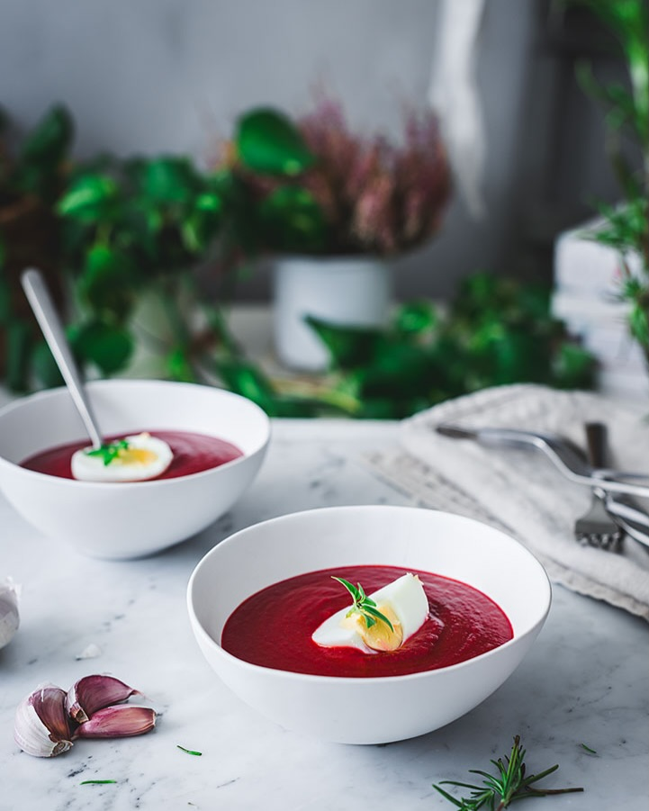

# Сальморехо из свеклы

#### Ингредиенты

на 4 порции

* вареная свекла 500 г
* помидоры консервированные резаные 300 г
* белый хлеб, вчерашний 120 г
* 1 зубчик чеснока
* соль
* оливковое масло 100 г
* яйца

#### Приготовление

Отварить свеклу. Замочить хлеб в воде на пару минут. В кухонном комбайне смешать все ингредиенты, кроме масла. Не добавлять всю свеклу сразу, чтобы не перебить вкус помидоров. После того, как все ингредиенты смешаются, постепенно добавить масло тонкой струйкой, чтобы получилась эмульсия.

Дать настояться в холодильнике от 2 ч перед подачей.

Подавать с вареными яйцами.

*IG: luisamoron.lifestyle*