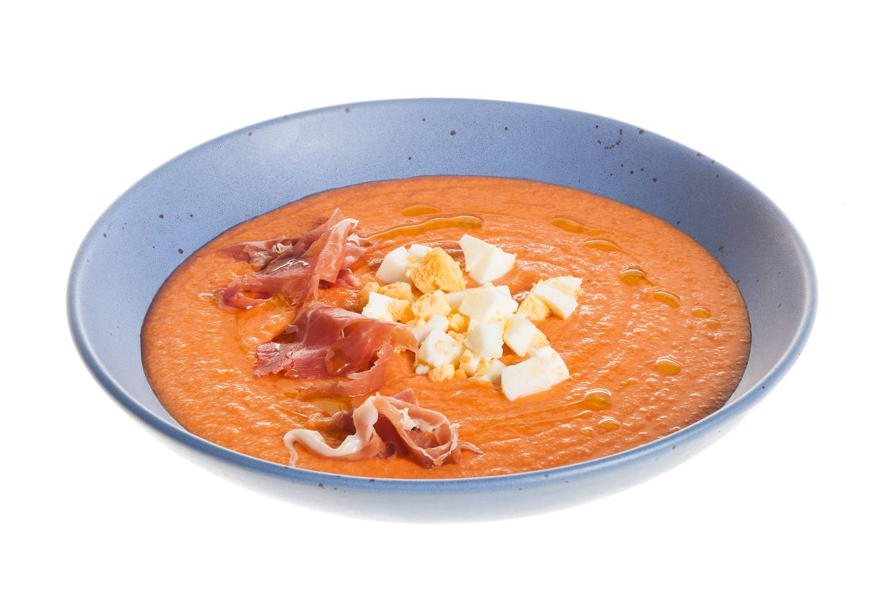

---
image: ../pics/photo_2023-06-20_14-57-26.jpg
---
# Сальморехо \| Salmorejo

#### Ингредиенты

* Помидоры 500 г
* Белый хлеб 250 г
* Чеснок 1 зубчик
* Хересный уксус 1 ст л
* Оливковое масло 70 мл
* Куриное яйцо 2 шт
* Хамон 4 куска
* Молотый черный перец, соль и сахар по вкусу

#### Приготовление

С хлеба срезать корки и нарезать крупно, так же нарезать помидоры. Пробить хлеб и помидоры в блендере вместе с чесноком, оливковым маслом и уксусом. Приправить сахаром, солью и перцем, убрать в холодильник на 15 минут.

В небольшом сотейнике довести воду до кипения и положить яйца, варить на среднем огне 10–12 минут. Охладить.

Крупно нарезать яйца и хамон. Разлить суп по тарелкам, подавать с ломтиками яиц, хамона и украсить капельками оливкового масла.

*eda.ru*
