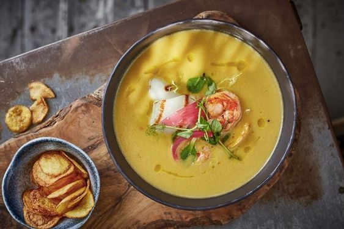

---
image: ../pics/seafood-cream.jpg
---
# Крем-суп из топинамбура с морепродуктами

#### Ингредиенты:

6 порций

**для основы супа:**

* Топинамбур 700 г (замены тыква, батат)
* Картофель 500 г
* Репчатый лук 300 г
* Морковь 300 г
* Чеснок 20 г
* Куркума 10 г
* Оливковое масло 70 мл
* Соль 10 г
* Черный молотый перец 5 г
* Сахар 20 г
* Вода 3 л

**для подачи:**

* Очищенные креветки 40 г
* Тушка кальмара 50 г
* Кресс-салат 1 г
* Паприка сухая 1 г
* Оливковое масло 10 г

#### Приготовление:

Овощи нарезать в произвольной форме и обжарить на оливковом масле. Обжаренные овощи залить кипятком и варить до готовности. В конце варки добавить специи. Пробить суп в блендере.

Креветки и кальмаров обжарить в паприке на оливковом масле. Посолить, поперчить. Крем-суп вылить в суповую тарелку. В центр выложить морепродукты и салат. Подавать с гренками

_от Андрея Макаева, шеф-повара ресторана Food Embassy_
