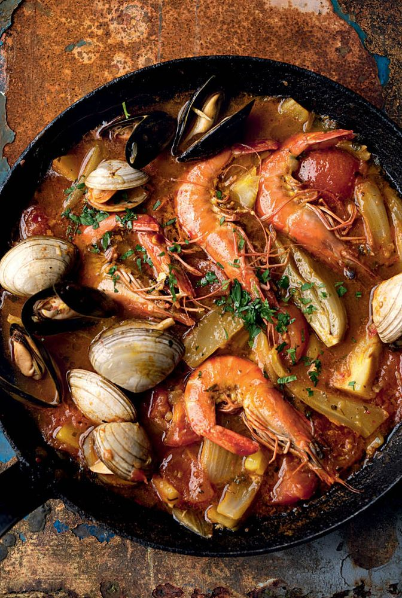

# Суп с морепродуктами и фенхелем

#### Ингредиенты

на 4 порции

* оливковое масло 2 ст л
* чеснок 4 зубчика
* фенхель 300 г
* картофель 200 г
* рыбный или овощной бульон 700 г
* соленый (консервированный) лимон 15 г
* помидоры целые консервированные без кожицы 400 г
* сладкая паприка 1 ст. л.
* шафран щепотка
* петрушка
* филе сибаса с кожей 300 г
* мидии 220 г
* моллюски ракушки 150 г
* тигровые креветки 220 г
* ракия 3 ст. л.
* тархун 2 ч. л.
* соль, перец

#### Приготовление

Фенхель и чеснок нарезать тонкими дольками, картофель очистить и нарезать кубиками по 1,5 см. Соленый лимон измельчить. Помидоры нарезать на четвертинки. Петрушку и тархун мелко нарезать.

В широкой глубокой сковороде или сотейнике разогреть оливковое масло. Выложить чеснок и прогреть его на среднем огне около 2 минут, не допуская подрумянивания. Добавить фенхель и картофель, обжаривать еще 3–4 минуты.

Влить бульон, добавить соленый лимон, 1/4 ч. л. соли и немного черного перца. Довести до кипения, закрыть крышкой и варить на слабом огне около 15 минут до размягчения картофеля. Затем добавить помидоры, специи и половину петрушки; проварить еще 4–5 минут.

Снова довести до кипения. Выложить филе рыбы и морепродукты, долить еще до 300 мл воды, если она не покрывает рыбу. Накрыть крышкой и активно кипятить 3–4 минуты, пока ракушки не раскроются, а креветки не порозовеют.

Шумовкой аккуратно переложить рыбу и морепродукты в отдельную посуду. Если бульон кажется жидковатым, выпарить его еще пару минут на сильном огне. Влить ракию, приправить рыбным соусом и перцем.

Подавать украсив петрушкой и тархуном.

*Yotam Ottolenghi, "Jerusalem"*
