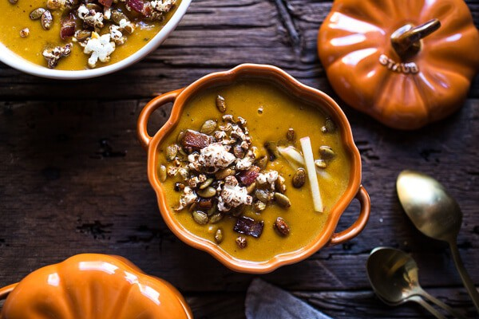

# Тыквенный суп на пиве

#### Ингредиенты

6 порций | 590 ккал

* 55г сливочное масло
* 1 большая картофелина
* 2 зубчика чеснока
* 30 г муки
* 470 г тыквенного пива
* 520 г куриного бульона
* 450 г тыквенного пюре
* 2 ч.л. тимьян
* 1/2 ч.л. копченой паприки
* 1/2 чайной ложки порошка карри
* соль + перец по вкусу
* 240 г жирных сливок
* 120 г копченого сыра Гауда
* 120 г копченого сыра чеддер
* 4 ломтика копченого бекона
* горсть очищенных тыквенных семечек
* 2 столовые ложки коричневого сахара

#### Приготовление

Запечь тыкву и переработать в пюре.  
Нагреть большую кастрюлю для супа на среднем огне, добавить масло и растопить. Добавить картофель и чеснок, готовить еще 5 минут или пока картофель не станет мягким. Добавить муку, готовить 1 минуту, помешивая муку, чтобы она покрыла овощи, приправить солью и перцем.  
Медленно влить пиво и бульон, помешивая, чтобы не образовывались комки. Добавить тыквенное пюре, тимьян, копченую паприку и порошок карри. Довести суп до кипения, а затем убавить огонь до слабого. Варить на медленном огне около 15 минут, до мягкости картофеля. Пюрировать блендером.

Добавить густые сливки, натертые копченую гауду и копченый чеддер, готовить на медленном огне, пока сыр полностью не расплавится. Если суп слишком густой, разбавить его куриным бульоном.

Выложить бекон, нарезанный кубиками, и тыквенные семечки на противень, хорошо перемешать с коричневым сахаром, распределить ровным слоем. Запечь в духовке при 170С около 20 минут, перемешать один раз в процессе приготовления.

Подавать суп украсив беконом.

*halfbakedharvest.com*
