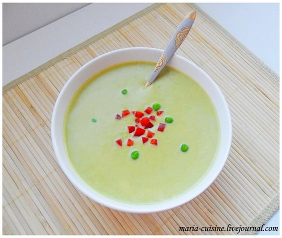

# Крем-суп из зелёного горошка \| Soupe de petis pois

## Ингредиенты:

6 порций \| 50 мин

* 1 кг свежего горошка \(или замороженного\)
* 1 л куриного бульона
* 2 луковицы
* 150 г жирной густой сметаны
* 25 г сливочного масла
* 1 красный болгарский перец

#### Приготовление:

Почистить свежий горошек, замороженный - разморозить. Почистить лук и мелко нарезать.

Растопить масло в кастрюле. Лак пассеровать в кастрюле до прозрачности. Залить бульоном и довести до кипения.

Уменьшить огонь, добавить горошек. Посолить, поперчить и варить 25 минут.

Горох с луком вытащить, бульон сохранить.

6 ст.л. зелёного горошка отложить в сторону.

Остальной горох превратить блендером на максимальной скорости в суп-пюре, постепенно добавляя бульон.

Суп поставить на медленный огонь, добавить отложенный горошек и сметану, прогреть не доводя до кипения.

Перец нарезать на мелкие кубики.

Суп при подаче посыпать перцем.

_maria-cuisine.livejournal.com_

