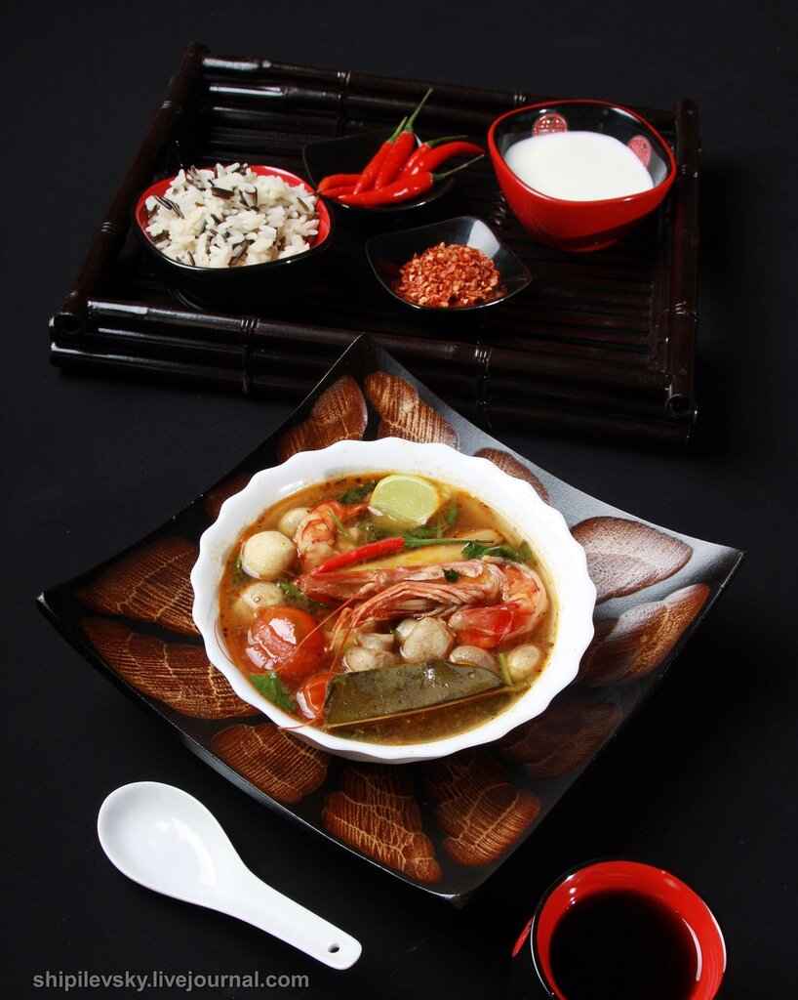

---
image: ../pics/tomyam.jpg
---
# Том-ям-кунг

Том-ям - это семейство супов, похожих по вкусовому портрету, но одновременно и существенно различающихся. Одинакова у всех представителей семейства их вкусовая основа - пряный ансамбль, иногда даже объединяемый в специальную том-ям пасту. Одинакова техника приготовления блюда. При этом, к основному названию "том-ям" прибавляется третье слово характеризующее конкретную разновидность. Том-ям варят с креветками (том-ям-кунг), с рыбой (том-ям-пла), с коктейлем морепродуктов (том-ям-талай), со свининой (том-ям-мо), с курицей (том-ям-кай) или даже делают овощным, вегетарианским (том-ям-пак). Иногда, в него добавляют кокосовое молоко, иногда вариативно меняются овощи и грибы. Если кокосовое молоко применяется (оно умягчает итоговый вкус блюда), то такой суп будет называться уже не просто том-ям, а том-ям-нам-кхон.  

#### Ингредиенты

* королевские креветки - 10 штук
* небольшие шампиньоны - 15 штук
* помидоры-черри - 10 штук
* рыбный соус нам-пла - 2 ст л
* жгучий перец - 6 штук
* пальмовый сахар - 3 ст л
* тамаринд
* паста нам-прик-пао - 1 ч л
* лемонграсс - 3 стебля
* фингеррут
* галангал
* листья каффира (или лаймовая цедра) - 4 штуки
* лайм - 1 штука
* зеленая кинза
* кокосовое молоко - 400 мл

#### Приготовление

Очистить креветки: отрезать головы, снять панцирь, вырезать кишечник. Головы и панцири сохранить на бульон.  
Обжарить в масле головы и панцири, залить водой и сварить бульон, готовый бульон процедить.  

Пока бульон варится, подготовить к закладке пряности. Одна из особенностей том-яма заключается в том, что это не полностью съедобный суп. Совершенно несъедобны лемонграсс, галангал, листья каффира.  
Лемонграсс разрезать пополам, галангал - большими, тонкими колечками, фингеррут нарезать мелко, листья каффира можно либо положить, как и лавр, целиком, либо, наоборот, порезать, как можно мельче (в последнем случае, лучше все же сначала удалить наиболее жесткую центральную жилку).

*Можно взять куриный бульон, очищенные креветки и готовую том-ям пасту.*

Опустить в бульон подготовленные пряности, пасту нам-прик-пао (или пасту том-ям) и перец. Варить 5 мин.  
Добавить соус нам-пла, тамаринд, сахар (столовая ложка на литр бульона), добиваясь нужного баланса острого, соленого, кислого и сладкого.  
Добавить в кастрюлю неразрезанные помидоры-черри (идеально - с предварительно снятой шкуркой) и такие же шампиньоны. Варить еще 5 мин.  
Добавить креветки и варить еще 5 мин. Порубленную кинзу добавить последней, выключая под кастрюлей огонь и одновременно выжимая в кастрюлю лайм.

Перед подачей влить кокосовое молоко. 
Подавать немедленно с отварным рисом.

*lg: world-cuisine*
