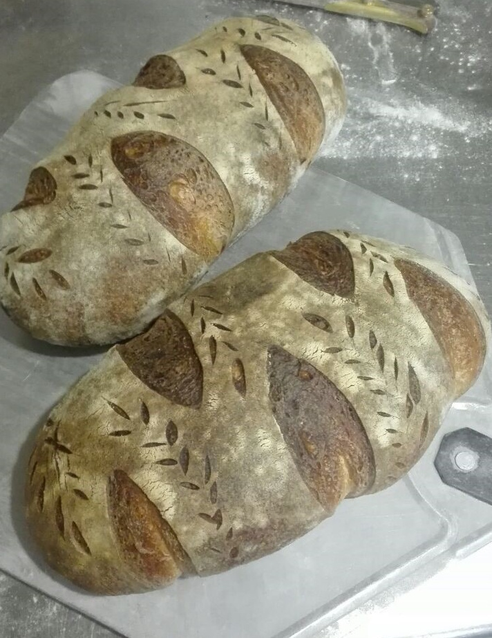

---
image: ../../pics/apple-cider-bread.jpg
---
# Яблочный хлеб на закваске

#### Ингредиенты

**для опары:**

* ржаная закваска 25 г
* сильная мука 100 г
* холодная вода 100 мл

**для теста:**

* вся опара
* сильная мука 250 г
* мука цз или ржаная цз 70 г
* соль 10 г
* яблочный сок или сидр 225 мл

#### Приготовление

Опару поставить на ночь. 

Замесить тесто. Выдерживать около 4 часов, складывая первые 2 часа раз в 30 минут и потом еще 2 раза после каждого часа

Формуем предварительно в шар, даем 15 мин отдохнуть под полотенцем, формуем в батон и в корзинку. Когда поднимется, режем и в печку. 

Второй вариант — опара утром, часов в 11, в 18 месите тесто, к 22 оно готово, сформованный хлеб убираете в холодильник подниматься ночь в холоде. Утром печете прямо из холодильника.

*tg:feedthebitch*
