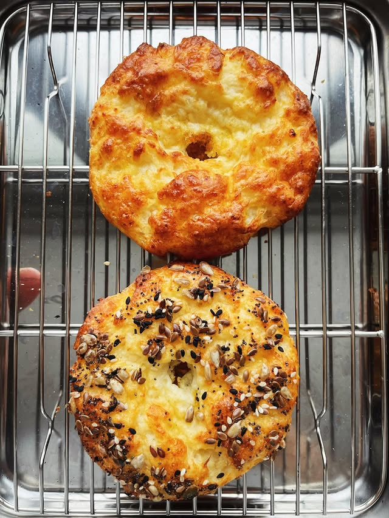

---
image: ../../pics/bagel-cottage-cheese.jpg
---
# Творожные бейглы

#### Ингредиенты

на 6 бейглов

* творог 5% 360 г
* мука 60 г
* мука рисовая 60 г
* разрыхлитель 10 г
* твердый сыр 30 г
* 1 яйцо
* соль щепотка
* 1 желток
* семечки для посыпки

#### Приготовление

Духовку разогреть до 180 градусов, с конвекцией.  
Смешать все ингридиенты кроме желтка и семечек. Разделить на 6 частей, сформовать в шары, влажными руками каждой придать форму бублика с дыркой.  
Перед выпечкой смазать желтком и посыпать семечками.  
Выпекать 20-25 минут.

*ig: hey.dmtb*

