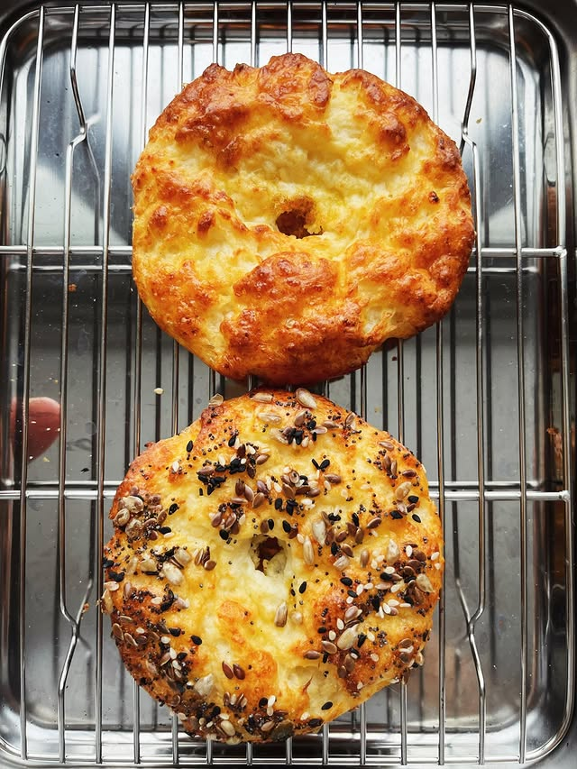

# Творожные бейглы

#### Ингредиенты

на 4 бейгла

* творог 5% 275 г
* мука 45 г
* мука рисовая 45 г
* разрыхлитель 8 г
* твердый сыр 25 г
* 1 яйцо (оставить немного желтка для смазывания)
* соль щепотка
* семечки для посыпки

#### Приготовление

Духовку разогреть до 180 градусов, с конвекцией.  
Смешать все ингридиенты кроме желтка и семечек. Разделить на 6 частей, сформовать в шары, влажными руками каждой придать форму бублика с дыркой.  
Перед выпечкой смазать желтком и посыпать семечками.  
Выпекать 20-25 минут.

*ig: hey.dmtb*

