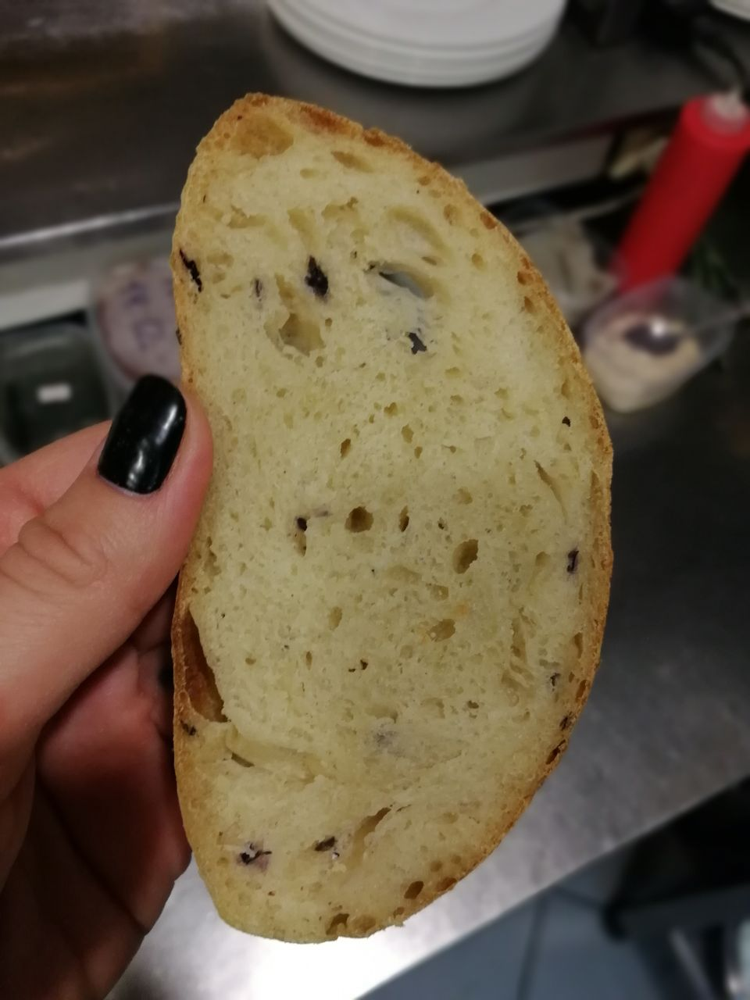

---
image: ../pics/basil-bread.jpg
---
# Базиликовый хлеб на закваске

#### Ингредиенты:

на два небольших батончика

* базилик без толстых стеблей 60 г 
* оливковое масло 2 ст л 
* пшеничная мука 500 г 
* вода 340 г 
* сухие дрожжи 8 г 
* соль 12 г 
* пшеничная закваска 100 г

#### Приготовление:

Базилик помыть, нарубить, положить в пакет, залить маслом и оставить на ночь. Утром замесить тесто и хорошо его вымесить. Добавить базилик и масло, вымесить окончательно. Поднимается он около 2 часов, за это время обмять его трижды (каждые 20 минут в первый час). Далее сделать предварительную формовку в шар и затем, дав отдохнуть 15 минут, сделать батончики. Выпекать на 230°С с надрезами и с паром первые 10 минут, затем допекать на 215°С еще около 20 минут.

*tg: feedthebitch*

