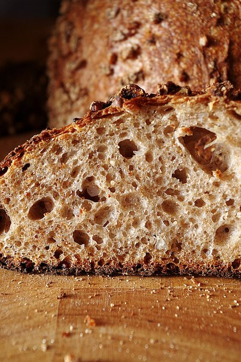

# Серый хлеб с бергамотом на закваске

#### Ингредиенты

**для опары:**
за 12 часов

* ржаная закваска 10 г
* ржаная мука 50 г
* вода 50 г

**для теста:**

* вся опара
* пшеничная мука сильная 150 г
* пшеничная мука цз 40 г
* ржаная мука 65 г
* вода 150 г
* чай Эрл Грей 10 г
* вода2 30 г
* соль 8 г

#### Приготовление

Опару поставить за 12 часов до замеса теста. Смешать все кроме соли и воды2, оставить на автолиз на 30 мин.  
Добавить воду2 и соль, вымесить и оставить ферментироваться на столе в миске под пленкой 4-5 часов, складывая каждый час.  
Сформовать буханку, оставить расстаиваться в тепле на 1-1.5 часа или убрать в холодную расстойку в холодильник до следующего утра.  
Выпекать на 240С, с паром в первые 10 мин.

*tg: feedthebitch*
